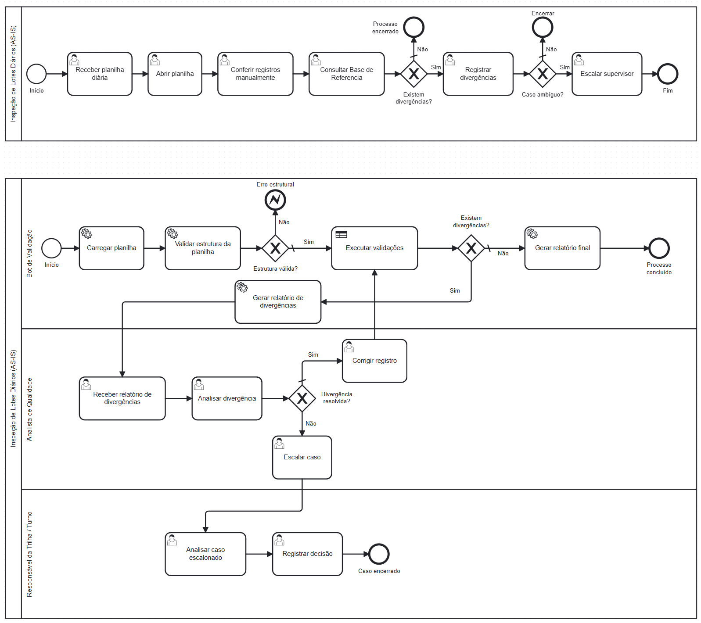

# Pipeline de Cadastro e Validação de Lotes

[](https://github.com/Messyas/exercicio-git-hyperautomation/actions/workflows/ci-cd.yml)

O projeto contém dois bots independentes, encadeados por um DataPool:

1. **Produtor Playwright**: lê a planilha bruta, cadastra cada lote no sistema
   web local, salva evidências e publica no DataPool apenas os cadastros
   concluídos.
2. **Consumidor compatível com BotCity**: consome o DataPool local ou remoto,
   executa RN01-RN07, atualiza o estado individual dos itens e gera o relatório
   Excel.

O fuso operacional é sempre `America/Manaus`. Rejeições do formulário,
divergências de negócio e falhas técnicas são classificadas separadamente;
nenhuma divergência interrompe o processamento dos itens seguintes.

Rejeições e falhas de cadastro não entram no DataPool. O Bot 1 preserva esses
itens em um relatório próprio, com os dados de origem, o motivo e o caminho da
evidência. Assim, o Bot 2 recebe apenas itens que concluíram a etapa anterior.

## Fluxo

```text
data/samples/inspecao_lotes_dia.xlsx
  -> producer.py + Playwright
       |-> erros de cadastro -> relatório de erros do Bot 1
       `-> cadastros concluídos -> DataPool local ou BotCity
                                  -> consumer.py + RN01-RN07 + XLSX
```

## Entrada processada

Por padrão, o projeto usa `data/samples/inspecao_lotes_dia.xlsx`. A primeira
aba contém os 25 registros didáticos e a aba `Base_Referencia` fornece os IDs
válidos usados pela RN03. O arquivo possui os campos `lote_id`, `produto`,
`linha`, `turno`, `status`, `responsavel`, `data` e `observacao`.

Para usar outro arquivo dentro do projeto, defina no `.env`:

```env
BOT_INPUT_FILE=data/samples/minha_planilha.xlsx
```

Não há monitoramento de pasta nem agendamento automático nesta versão. O fluxo
é iniciado por comando local, Docker Compose, GitHub Actions ou BotRunner.

## Modelagem do processo

A imagem abaixo apresenta o **AS-IS** e o **TO-BE** do processo modelado de
inspeção de lotes. Os detalhes e limites da automação estão no
[PDD do processo](docs/pdd/PDD_Process_Design_Document.md).



A interface web de demonstração é a aplicação HTML autônoma em `web/lote-teste.html`. Seus registros são mantidos no `localStorage` do navegador; o contrato persistente entre os bots é o DataPool.

## Aplicação Web `web/lote-teste.html`

O projeto utiliza a página estática `web/lote-teste.html`, aberta pelo Playwright através do protocolo `file://`. A aplicação possui formulário de login, cadastro de lotes com validação semântica, seleção de produto, rádio de status, responsável, data e observação, armazenando o resultado no `localStorage` com respostas em tempo real (`role="status"` e `role="alert"`).

| Funcionalidade | Implementação em `web/lote-teste.html` |
| --- | --- |
| Acesso | Caminho local `file://` direto pelo Playwright |
| Autenticação | Formulário de login funcional com usuário/senha |
| Campos | `lote_id`, `produto`, `linha`, `turno`, `status`, `responsavel`, `data`, `observacao` |
| radio button de status | campo de texto para preservar o valor original |
| status padrão `pendente` | status padrão `APROVADO` |
| opções como `TV-55` | códigos do domínio, como `TV55-4K-B` |
| `PlaywrightFormularioLotesPage` | fachada E2E que reutiliza os Page Objects de `src/pages/` |

Os oito testes E2E verificam título, lote, produto, status padrão, envio do
formulário, validações negativas e captura de screenshot no Chromium.

O formulário registra os oito campos da planilha: `lote_id`, `produto`,
`linha`, `turno`, `status`, `responsavel`, `data` e `observacao`. O status é
mantido como texto para que valores não normalizados também cheguem ao Bot 2,
responsável pela aplicação das regras RN01-RN07.

A página estática exige apenas lote e produto para concluir o cadastro demonstrativo.
As demais obrigatoriedades pertencem ao motor de regras do Bot 2. Por isso, um
responsável vazio chega ao DataPool para ser classificado pela RN02, enquanto
um lote sem ID é rejeitado pelo Bot 1 e registrado no relatório de erros do
produtor.

A inicialização do Chromium fica em `src/web_automation.py`.
`src/playwright_automation.py` controla o restante do ciclo de vida do browser.

## Execução com Docker

Pré-requisito único: Docker Desktop (ou Docker Engine) com Docker Compose. O
fluxo padrão não exige Python, credenciais, frontend separado ou arquivo `.env`.

### Exercício 24-A: API e classificador em um comando

Na raiz do repositório, execute:

```bash
docker compose --profile ml up --build --abort-on-container-exit --exit-code-from bot-classificador api-ml bot-classificador
```

O comando cria a API FastAPI, aguarda o healthcheck do modelo, processa a
planilha de 10 dias pelo `bot-classificador`, grava os artefatos em
`data/output/` e encerra todos os containers ao fim. A 9ª aba e o arquivo
`data/output/execucao_dashboard.log` registram as decisões de ML.

Para manter somente a API disponível para testes manuais:

```bash
docker compose --profile ml up --build api-ml
```

Teste a saúde em outro terminal:

```bash
curl http://localhost:8000/health
```

Para ensaiar a sabotagem, inicie o comando completo acima e, enquanto o
`bot-classificador` estiver processando, execute em outro terminal:

```bash
docker compose kill api-ml
```

O bot deve concluir o lote com `REVISAO_ML_OFFLINE`; após cinco falhas, as
próximas decisões indicam o circuit breaker aberto.

### Pipeline legado de cadastro e conferência

O formulário de demonstração é o arquivo estático `web/lote-teste.html`; não há
serviço `frontend`. Para executar o pipeline legado em container:

```bash
docker compose --profile avaliacao run --build --rm bot-conferencia
docker compose run --rm --no-deps --entrypoint python bot-conferencia scripts/verify_pipeline.py
```

O `.env` é opcional. Copie `.env.example` apenas para substituir valores padrão:

```powershell
Copy-Item .env.example .env
```

## Saídas no host

```text
screenshots/local/<batch_id>/produtor/             screenshots de sucesso e erro
data/datapool/*.processed.json                      estado final do DataPool local
data/output/relatorio_erros_fluxo_produtor_*.xlsx  erros retidos pelo Bot 1
data/output/relatorio_divergencias_*.xlsx          resultado do Bot 2
logs/produtor/execucao.log                          log JSON Lines do produtor
logs/validador/execucao.log                         log JSON Lines do consumidor
logs/*/resumo_execucao.json                         resumo de cada bot
reports/                                             volume reservado
```

Cada item do DataPool preserva `evidence_name` para compatibilidade e também
registra `evidence_path`. No container, o caminho começa em `/app/screenshots`;
esse diretório corresponde a `./screenshots` no host. DataPools já existentes
no Maestro precisam receber a coluna textual `evidence_path` antes do deploy.

Na planilha didática atual, o resultado esperado é:

- 25 tentativas de cadastro pelo Bot 1;
- 24 cadastros web bem-sucedidos e publicados no DataPool;
- 1 rejeição por lote sem ID, retida no relatório de erros do Bot 1;
- 8 registros divergentes identificados pelo Bot 2;
- 9 violações de regras nesses 8 registros do Bot 2;
- 9 exceções no fluxo completo, somando a rejeição do Bot 1 e as 8
  divergências do Bot 2;
- 16 lotes validados;
- 2 itens para revisão humana.

O Bot 1 termina como `PARTIALLY_COMPLETED` porque preserva a rejeição sem
interromper o lote. O Bot 2 termina como `SUCCESS`; no DataPool local, 16 itens
ficam `DONE` e 8 ficam `ERROR` do tipo `BUSINESS`.

## Dashboard executivo da planilha de 10 dias — Aula 24

O dashboard é um fluxo independente do processo legado RN01–RN07. Ele aplica
RN01–RN12 à planilha de dez dias, preserva cada `RegistroValidado` e calcula os
indicadores uma única vez antes de gerar todos os artefatos.

```text
Planilha + Base de Referência
  -> validação RN01–RN12
  -> OperationalIndicators
  -> Excel (9 abas) + resumo executivo Markdown + PDF compatível + log
```

Execute o fluxo oficial com:

```bash
python -m dashboard.main \
  --entrada "data/samples/inspecao_lotes_10dias_sem gabarito.xlsx" \
  --saida data/output
```

Os dez indicadores incluem volume processado, classificações, regra mais
acionada, qualidade da entrada, revisão humana, retrabalho e ganho de tempo.
Para o conjunto didático, o resultado esperado é 250 registros: 150 válidos,
50 divergências, 20 ambíguos, 30 erros de entrada, RN06 como regra principal
(25 ocorrências) e 437,5 minutos de ganho estimado.

O ganho é uma **estimativa didática**, baseada em 2,00 minutos por registro no
processo manual e 0,25 minuto no automatizado; não representa uma medição de
produção. As taxas devem ser interpretadas com as limitações do conjunto de
dados didático e não substituem telemetria operacional contínua.

Os artefatos são gravados em `data/output/`: Excel com nove abas, resumo
executivo Markdown, PDF compatível e log. Para detalhes sobre as abas, o
dicionário, Docker e demonstração, consulte [dashboard/README.md](dashboard/README.md).

### Testes do dashboard

```bash
python -m pytest -m unit -v
python -m pytest -m integration -v
python -m pytest -m regression -v
python -m pytest -m "e2e and not browser" -v
python -m pytest -m "not browser" --cov=src --cov=dashboard \
  --cov-config=.coveragerc --cov-report=term-missing \
  --cov-report=xml:reports/coverage.xml \
  --cov-report=html:reports/coverage-html --cov-fail-under=80
```

## DataPool BotCity

> Não crie o DataPool antes de implantar os dois bots. O produtor só cria a
> tarefa do validador depois de publicar o lote completo.

Gere os dois pacotes independentes:

```bash
python scripts/build_botcity_packages.py
```

Os arquivos ficam em `dist/botcity/` e contêm `bot.py` e `requirements.txt`
na raiz, como esperado pelo Runner. O workflow manual `CD - Bots BotCity`
permite `deploy`, `update` e `release`; configure no GitHub os secrets
`BOTCITY_SERVER`, `BOTCITY_LOGIN` e `BOTCITY_KEY` antes de executá-lo.

No Runner Windows, a página de demonstração é empacotada como
`web/lote-teste.html`; não é necessário iniciar um frontend ou serviço web.

Após a primeira instalação do ambiente virtual do bot produtor, instale o
Chromium com o Python daquele ambiente:

```powershell
python -m playwright install chromium
```

O entrypoint reconhece automaticamente os argumentos `server/task/token`
injetados pelo BotRunner; credenciais de desenvolvimento não precisam ficar
em `.env` no pacote.

O modo local é usado por padrão:

```env
DATAPOOL_BACKEND=local
```

No BotCity Orchestrator:

1. configure as credenciais de desenvolvimento ou execute pelo Runner;
2. defina `MAESTRO_ENABLED=true` e `DATAPOOL_BACKEND=botcity`;
3. crie o schema uma única vez:

   ```bash
   python -m scripts.create_datapool
   ```

4. registre a automação consumidora com o label definido em
   `VALIDATOR_ACTIVITY_LABEL`;
5. execute o produtor.

O produtor tenta cadastrar todas as entradas e só publica as que concluíram o
cadastro web. Depois de publicar esse lote filtrado, cria a tarefa do
consumidor. O campo `item_id`, formado pelo hash do arquivo e pela linha de
origem, fornece idempotência. Um `lote_id` vazio é retido pelo Bot 1; IDs
duplicados ou não encontrados na referência ainda chegam ao Bot 2 para a
aplicação das regras de negócio.

Itens válidos terminam como `DONE`. Divergências RN01-RN07 terminam como erro
`BUSINESS`, sem acionar retentativa de sistema. Falhas técnicas usam erro
`SYSTEM`.

Ao finalizar a tarefa, o validador reporta ao Maestro `total_items`,
`processed_items` e `failed_items`. Itens `DONE` contam como processados com
sucesso; divergências de negócio e falhas técnicas contam como falhas.

## Logs estruturados

Todas as linhas contêm:

- `execution_id`;
- `bot_id`;
- `batch_id`;
- `lote_id`;
- `source_row`;
- timestamp, nível, logger e mensagem.

No Compose, os IDs dos bots são:

- `bot-lotes-cadastro-playwright-mk7`;
- `bot-lotes-validacao-mk7`.

## Desenvolvimento e testes

Use Python 3.12. O ambiente virtual não é obrigatório, mas evita conflitos com
outros projetos.

### Preparar o ambiente no Windows PowerShell

```powershell
py -3.12 -m venv .venv
.\.venv\Scripts\Activate.ps1
python -m pip install --upgrade pip
python -m pip install -r requirements-dev.txt
```

Se não quiser ativar o ambiente, execute os comandos com
`.\.venv\Scripts\python.exe` no lugar de `python`.

No Linux ou macOS:

```bash
python3.12 -m venv .venv
source .venv/bin/activate
python -m pip install --upgrade pip
python -m pip install -r requirements-dev.txt
```

O arquivo `requirements-dev.txt` instala as dependências da aplicação,
`pytest`, `pytest-cov` e `pytest-playwright`. Ele não instala Selenium.

### Suíte consolidada da Aula 23

A suíte é organizada estritamente em quatro pastas correspondentes às camadas de teste (`tests/unit/`, `tests/integration/`, `tests/regression/`, `tests/e2e/`). Os markers são declarados e validados com `--strict-markers` pelo `pytest.ini`:

- `unit`: funções isoladas e regras RN01–RN12;
- `integration`: colaboração entre leitura, validação, DataPool e relatório;
- `regression`: alarmes isolados para comportamentos corrigidos e salva-guardas de regras (RN05, RN07, RN10, RN11, RN12);
- `e2e`: fluxo completo sintético de dados até o relatório/dashboard executivo;
- `browser`: E2E opcional com Chromium e interface web;
- `slow`: testes de maior duração (pipeline de 10 dias e navegadores).

Executar a suíte completa sem browser ou serviço externo:

```bash
python -m pytest -m "not browser" -q -rsxX
```

Executar cada camada isoladamente:

```bash
python -m pytest -m unit -v
python -m pytest -m integration -v
python -m pytest -m regression -v
python -m pytest -m "e2e and not browser" -v
python -m pytest -m slow -v
```

O E2E local cria uma planilha sintética de 10 dias e 250 registros em
`tmp_path`, simula a `Base_Referencia` com `MagicMock`, fixa o relógio e confere
o gabarito de 150 válidos, 50 divergências, 20 ambíguos e 30 erros de entrada.
Ele não usa internet, credenciais ou arquivo preparado manualmente.
Os testes legados dos adaptadores Excel ainda usam apenas fixtures versionadas
em `data/samples`; a lógica de negócio e o E2E da Aula 23 usam dados sintéticos
e mocks, portanto não dependem de arquivos locais não versionados.

Os motivos de limitações conhecidas aparecem com:

```bash
python -m pytest -q -rsxX
```

Atualmente, a integração real com Maestro é `SKIPPED` por exigir credenciais de
homologação. A aceitação de datas impossíveis em nomes de aba é `XFAIL` estrito
e documenta um bug conhecido da RN12.

### Cobertura

A cobertura mínima obrigatória é 80%. O comando usado localmente e no CI é:

```bash
python -m pytest -m "not browser" -q \
  --cov=src --cov=dashboard --cov-config=.coveragerc \
  --cov-report=term-missing --cov-fail-under=80
```

A medição consolidada da implementação da Aula 23 atingiu 85,84%; a medição
literal de `src` atingiu 84,33%. A
configuração exclui apenas os Page Objects/Playwright e a interface Streamlit:
essas interfaces pertencem ao job de browser, enquanto
`dashboard/gerar_relatorio.py` e `dashboard/servico_validacao.py` continuam
obrigatoriamente cobertos. O CI anexa `reports/coverage.xml` como evidência.

### E2E opcional de browser

Instale o Chromium e habilite explicitamente os testes. Eles usam a página
estática local e não precisam de serviço web:

```powershell
python -m playwright install chromium
$env:RUN_BROWSER_E2E = "1"
python -m pytest -m browser -v
```

### Pipeline completo em Docker

Este caminho não usa o ambiente virtual local. As dependências e o Chromium são
instalados na imagem:

```bash
docker compose --profile avaliacao build bot-conferencia
docker compose run --rm bot-conferencia
docker compose run --rm --no-deps --entrypoint python bot-conferencia scripts/verify_pipeline.py
docker compose --profile avaliacao down --volumes --remove-orphans
```

O workflow `.github/workflows/ci-cd.yml` executa qualidade Python, testes
unitários, oito testes E2E, pipeline completo em container e
checagem de credenciais. Os jobs publicam screenshots, DataPool local, logs e
relatórios com `actions/upload-artifact@v4`.

## Escopo e limitações das automações web

Na branch `main`, a automação web usa Page Object Model com Playwright e está
integrada ao produtor, ao DataPool e ao Maestro.

O Selenium não faz parte desta branch nem do pipeline atual. A implementação
comparativa usada no passado está em `origin/feature/page-objects`. A branch
`main` mantém apenas o POM Playwright.

Outras limitações conhecidas: a página estática de demonstração aceita qualquer par
não vazio de usuário e senha e persiste os lotes somente no `localStorage` do
navegador. O estado durável entre os bots é o DataPool, não a página estática.

Também não fazem parte desta versão: agendamento ou monitoramento de pasta,
autenticação de produção, integração com ERP/MES, correção automática dos casos
de revisão humana e reprocessamento automático após a decisão do analista.

## Estrutura principal

```text
producer.py                         entrypoint do bot produtor
consumer.py                         entrypoint do bot consumidor
pipeline.py                         execução conjunta para o perfil avaliacao
bot.py                              núcleo de validação RN01-RN07
api_ml/                             microserviço FastAPI da camada de ML
  main.py                           lifespan, /predict e /health
  schemas.py                        LoteInput, PredictionOutput e HealthOutput
  model_service.py                  ModelService e regras de confiança
  features.py                       normalização compartilhada e FEATURE_ORDER
  Dockerfile
  requirements.txt
models/
  classificador_lotes.pkl           bundle binário do modelo treinado (joblib)
  classificador_lotes.metrics.json  métricas de avaliação e calibração
data/ml/
  historico_lotes_sintetico.csv     dataset sintético com 12.000 amostras
  dataset_manifest.json             manifesto de distribuição e SHA-256
scripts/
  train_model.py                    gerador de dataset sintético e treino
  demo_torneio.py                   execução e auditoria dos 50 casos ambíguos
  auditar_modelo_ml.py              auditoria de viés, robustez e calibração
src/excel_source.py                 adaptador da planilha bruta
src/datapool_gateway.py             DataPool local e BotCity
src/item_processor.py               processador de itens ambíguos com auditoria ML
src/ml_client.py                    MLClient + CircuitBreaker + MLPrediction DTO
src/ml_client_factory.py            factory para criação resiliente do MLClient
src/playwright_automation.py        ciclo do navegador
src/web_automation.py               lançamento do Chromium local/container
src/pages/playwright_pages.py       locators semânticos e waits
tests/unit/                         testes unitários (incluindo api_ml, ml_client, dataset)
tests/integration/                  testes de integração (incluindo pipeline_ml e sabotagem)
tests/regression/                   alarmes de regressão (RN05, RN07, RN10, RN11, RN12)
tests/e2e/                          testes end-to-end de pipeline e browser
src/maestro_client.py               Maestro, artefatos e logs JSON
web/lote-teste.html                 página HTML estática de cadastro
```

## Camada de Machine Learning (Aula 24-A)

Para uma revisão do Exercício 24-A sem executar containers ou testes, consulte
[Evidências de avaliação](docs/EVIDENCIAS_EXERCICIO_24A.md). O documento reúne
requisitos, arquivos de implementação, resultados observados e limitações.

A camada de Machine Learning atua exclusivamente como uma camada secundária aplicada apenas aos registros que as regras de negócio RN01–RN12 classificaram como `Ambíguo`. As regras de negócio continuam sendo a primeira camada de decisão soberana e não são reescritas nem substituídas pelo modelo.

### 1. Dataset Sintético (12.000 amostras)

- **Geração Determinística**: Gerado por `scripts/train_model.py` com `seed=42`.
- **Estrutura de Colunas (`data/ml/historico_lotes_sintetico.csv`)**: `sample_id`, `status_raw`, `turno`, `tem_obs`, `classe`.
- **Features do Modelo (`FEATURE_ORDER`)**: `status_raw`, `turno`, `tem_obs`. `sample_id` é apenas identificador sintético de rastreabilidade.
- **Classes Balanceadas (4.000 amostras por classe)**: `valido_automatico`, `revisar`, `recusar_automatico`.
- **Turnos (A, B, C)**: Distribuídos de forma uniforme em todas as combinações de classe/turno.
- **Vocabulário Ambíguo**: Apenas variações de status que chegam à camada de ambiguidade (`PENDENTE`, `EM ANÁLISE`, `EM AJUSTE`, `ESPECIFICAÇÃO EM REVISÃO`, `AGUARDANDO REINSPEÇÃO`, `APROVADO PARCIAL`, `CANCELADO`, `AJUSTE CONCLUIDO`, `AJUSTE REPROVADO`, `REINSPECAO REPROVADA`, `FORA DE ESPECIFICACAO`). Os acentos e múltiplos espaços são normalizados deterministicamente por `normalizar_status_raw()`.
- **Probabilidades Condicionais**: O gerador atribui probabilidades condicionais com sobreposição realista de 10%–20% entre classes. O `turno` **não altera** as probabilidades no gerador, permitindo provar em teste que a acurácia do modelo é homogênea entre os turnos A, B e C.

### 2. Justificativa de Exclusão de Identificadores e Proxies

Identificadores de produção como `lote_id`, `produto`, `linha`, `responsavel`, `data` e o texto livre da `observacao` foram **estritamente excluídos** do vetor de features do modelo. O uso desses campos causaria data leakage, overfitting e viés indevido (ex: penalizar operadores ou produtos específicos).

### 3. Modelo, Calibração e Métricas

- **Algoritmo**: `RandomForestClassifier` (200 estimadores, `max_depth=8`, `class_weight="balanced_subsample"`) calibrado com `CalibratedClassifierCV(method="sigmoid", cv=5, ensemble=False)`.
- **Divisão dos Dados**: Split 80/20 estratificado por `classe + turno`.
- **Métricas Registradas (`models/classificador_lotes.metrics.json`)**:
  - Accuracy: 83,83%
  - Macro F1: 83,89%
  - Cobertura de Alta Confiança (`p >= 0.85`): 49,75%
  - Equidade entre Turnos: diferença máxima de acurácia de 3,17 pontos percentuais
  - Latência P50 unitária: 29,77 ms

### 4. API HTTP FastAPI (`api_ml/`)

- `GET /health`:
  - `200 OK`: `{"status": "ok", "model_loaded": true, "modelo_versao": "rf-lotes-1.0.0"}`
  - `503 Service Unavailable`: `{"status": "unavailable", "model_loaded": false, "modelo_versao": null}`
- `POST /predict`:
  - Entrada: `LoteInput` (`lote_id`, `status_raw`, `turno`, `tem_obs`).
  - Validação de entrada: `turno` diferente de `A`, `B` ou `C` retorna HTTP `422 Unprocessable Entity`.
  - Saída: `PredictionOutput` (`lote_id`, `classe`, `probabilidade`, `nivel_confianca`, `acao`, `modelo_versao`).
  - Limiares de Decisão:
    - `probabilidade >= 0.85`: Confiança ALTA. Ação automática conforme a classe predita (`VALIDO_AUTOMATICO` ou `RECUSAR_AUTOMATICO`); contudo, predições da classe `revisar` permanecem `REVISAR`.
    - `0.65 <= probabilidade < 0.85`: Confiança MÉDIA. Ação `REVISAR`.
    - `probabilidade < 0.65`: Confiança BAIXA. Ação `REVISAO_PRIORITARIA`.

### 4.1 Concorrência e latência da API

`/predict` é propositalmente uma função síncrona (`def`), pois a inferência do
scikit-learn é CPU-bound; o FastAPI a executa no pool de threads sem bloquear o
event loop. O middleware assíncrono limita as inferências simultâneas com
`ML_MAX_CONCURRENCY` (padrão `1` para evitar sobrecarga de uma Random Forest que
já usa CPU internamente) e aplica backpressure às requisições excedentes.

Cada resposta expõe os headers `X-Inference-Latency-Ms`,
`X-Request-Latency-Ms` e `X-Queue-Wait-Ms`. O bot também registra a latência
ponta a ponta em `ML_DECISION`, e o ensaio do Torneio calcula P50, P95, média e
máximo no relatório JSON.

### 5. Resiliência, Circuit Breaker e Fallback

- **MLClient Resiliente**: O cliente HTTP em `src/ml_client.py` captura qualquer exceção de timeout, erro de transporte, HTTP não-2xx ou JSON inválido, retornando `None` sem derrubar a execução do robô.
- **Circuit Breaker**: O breaker possui 2 estados (`CLOSED` e `OPEN`). Após 5 falhas consecutivas de rede/API, o circuito abre (`is_open == True`). Da 6ª chamada em diante, o cliente retorna imediatamente `None` sem realizar requisições de rede.
- **Ação em Queda de Serviço**: Quando o cliente retorna `None` (por erro ou circuito aberto), o `ItemProcessor` registra uma decisão com `acao_final = "REVISAO_ML_OFFLINE"`. O processamento do lote continua normalmente até o último registro.
- **Reset do Circuit Breaker**: O circuito pode ser redefinido programaticamente chamando `ml_client.reset_circuit()` ou reiniciando a aplicação.

### 6. Relatório Excel de 9 Abas e Logs de Auditoria

O relatório consolidado em `data/output/relatorio_conferencia_lotes.xlsx` possui exatamente 9 abas:
1. Resumo
2. Todos
3. Válidos
4. Divergências
5. Ambíguos
6. Erros de Entrada
7. Ranking de Regras
8. Dicionário
9. **Decisões de ML**

A 9ª aba armazena uma linha para cada registro ambíguo processado (quantidade de linhas de decisão == quantidade de registros ambíguos), contendo probabilidade formatada como `0.00%`, latência em ms, flag de tentativa de rede, estado do circuit breaker e versão do modelo. Simultaneamente, o evento estruturado `ML_DECISION` é gravado no log JSON Lines sem expor o texto livre de observação do registro.

### 7. Comandos de Treinamento, Testes e Ensaio de Sabotagem

```bash
# 1. Gerar dataset sintético de 12.000 linhas e treinar o modelo calibrado
python scripts/train_model.py

# 2. Executar suíte de testes unitários e de integração de ML (incluindo sabotagem)
python -m pytest tests/unit/test_api_ml.py tests/unit/test_ml_client.py tests/unit/test_item_processor_ml.py tests/unit/test_dataset_ml.py tests/unit/test_model_training.py tests/unit/test_relatorio_ml.py tests/integration/test_pipeline_ml.py tests/integration/test_sabotagem_ml.py -v

# 3. Testar a configuração do Docker Compose (inclui o serviço api-ml)
docker compose --profile ml config --quiet

# 4. Executar a API e o classificador sem instalar Python localmente
docker compose --profile ml up --build --abort-on-container-exit --exit-code-from bot-classificador api-ml bot-classificador

# 5. Subir apenas a API para o ensaio do Torneio
docker compose --profile ml up -d --build api-ml

# 6. Ensaio padrão: 50 JSONs, 5 workers e fila limitada a 20 pendências
python scripts/demo_torneio.py --total 50 --workers 5 --queue-size 20 --api-url http://127.0.0.1:8000

# 7. Ensaio de sabotagem: derruba api-ml após 10 chamadas e verifica fallback
python scripts/demo_torneio.py --total 50 --workers 5 --queue-size 20 --api-url http://127.0.0.1:8000 --sabotage-docker --sabotage-after 10

# 8. Estresse com backpressure: 1.000 chamadas sem criar 1.000 conexões simultâneas
python scripts/demo_torneio.py --total 1000 --workers 10 --queue-size 50 --api-url http://127.0.0.1:8000

# 9. Encerrar a API ao terminar os ensaios
docker compose --profile ml down
```

O ensaio valida localmente cada JSON antes do envio, exige que a API rejeite
`turno` inválido, campos extras e booleanos coagidos (HTTP 422), valida o
contrato da resposta e gera `data/output/ensaio_torneio_ml.json`. A flag
`--sabotage-docker` é opt-in: ela executa `docker compose kill api-ml`; depois
da sabotagem, o relatório deve apresentar fallbacks e circuit breaker aberto,
sem perder tarefas da fila.

### 8. Auditoria de viés, robustez e confiança do modelo

Random Forest não interpreta instruções, portanto não sofre *prompt injection*
como um LLM. Os riscos equivalentes são dados de treino envenenados, entradas
fora da distribuição, correlações espúrias, vazamento de dados e probabilidades
mal calibradas. Execute a auditoria com:

```bash
python scripts/auditar_modelo_ml.py --output-dir reports/model_audit --fail-on-alert
```

Ela gera `auditoria_modelo_ml.json` e `auditoria_modelo_ml.md`, verificando SHA
do dataset, features permitidas, calibração (ECE), desempenho por turno, teste
contrafactual ao variar apenas o turno e entradas fora do vocabulário (incluindo
textos de prompt injection, SQL e HTML). Um alerta não prova intenção ou fraude:
ele indica uma condição que precisa de análise humana e, idealmente, dados reais
representativos.
