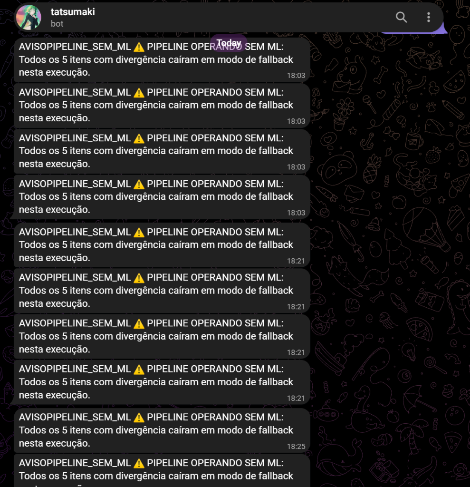

# Evidências de Avaliação — Estudo de Caso S10-B (Pipeline Híbrido RPA+ML)

Este documento reúne as evidências visuais e técnicas de execução do **Estudo de Caso S10-B**, cobrindo a resiliência do pipeline, notificação multicanal via Telegram e os 5 cenários de simulação de crise ao vivo.

---

## 🔔 1. Evidência de Notificação Multicanal (Telegram)

Na execução dos cenários de teste da Simulação de Crise (`scripts/simular_cenarios_sabotagem.py` ou `docker-compose.sabotagem.yml`), o sistema dispara notificações automáticas de severidade `AVISO` para o Telegram (`PIPELINE_SEM_ML`) quando o componente de ML opera em modo de fallback:

### Rastreamento das Mensagens no Telegram:
* **Cenários 1 a 4:** 4 alertas entregues com sucesso no Telegram (`HTTP 200 OK`) informando `PIPELINE OPERANDO SEM ML`.
* **Cenário 5:** Teste de token inválido (`TOKEN_INVALIDO_12345`). O envio falha no Telegram como esperado (`HTTP 404 Not Found`) e o sistema redireciona o alerta para o canal de fallback (Log Local).

---

## 🛡️ 2. Resumo da Simulação de Crise (5 Cenários)

| Cenário | Falha Simulada | Comportamento Esperado | Status |
| --- | --- | --- | :---: |
| **1** | Base de referência indisponível | Retry com backoff acionado; fallback para `PENDENTE_REVISAO`. | ✅ APROVADO |
| **2** | Serviço de ML fora do ar | Bot não trava; itens caem em fallback seguro com `origem_decisao = fallback`. | ✅ APROVADO |
| **3** | ML lento (Timeout 1ms) | Timeout respeitado sem travar o processamento do lote. | ✅ APROVADO |
| **4** | ML com baixa confiança (`confiança >= 0.999`) | Descarte da predição fraca e aplicação de fallback. | ✅ APROVADO |
| **5** | Canal de alerta principal falha (Telegram inválido) | Fallback de canal ativado (Log Local / WhatsApp / Email). | ✅ APROVADO |

O relatório gerado automaticamente pela execução fica em `reports/evidencias_sabotagem/resumo_evidencias_sabotagem.json`.
