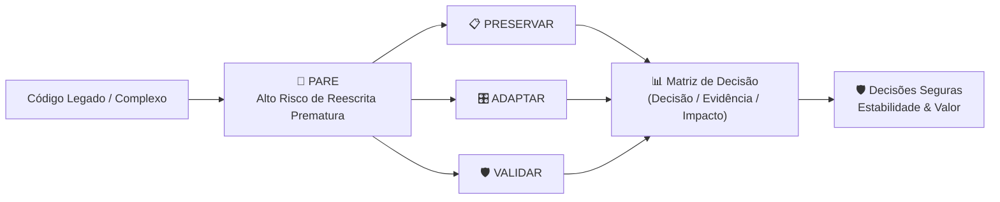
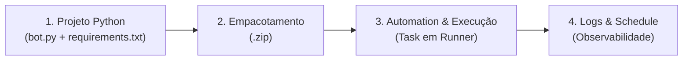
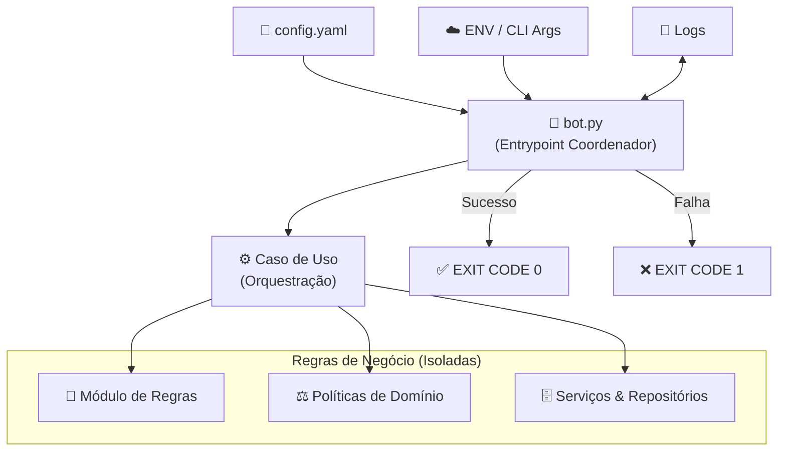
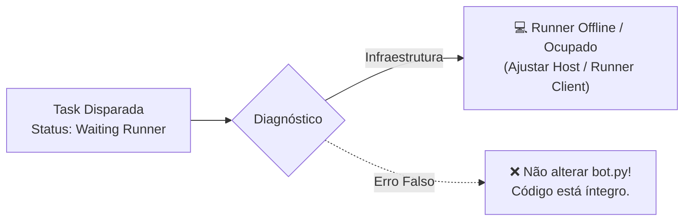
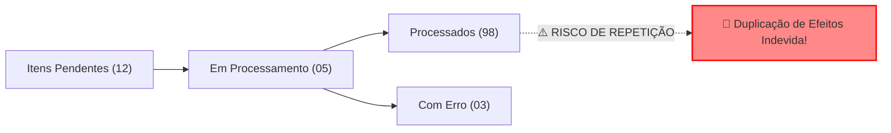
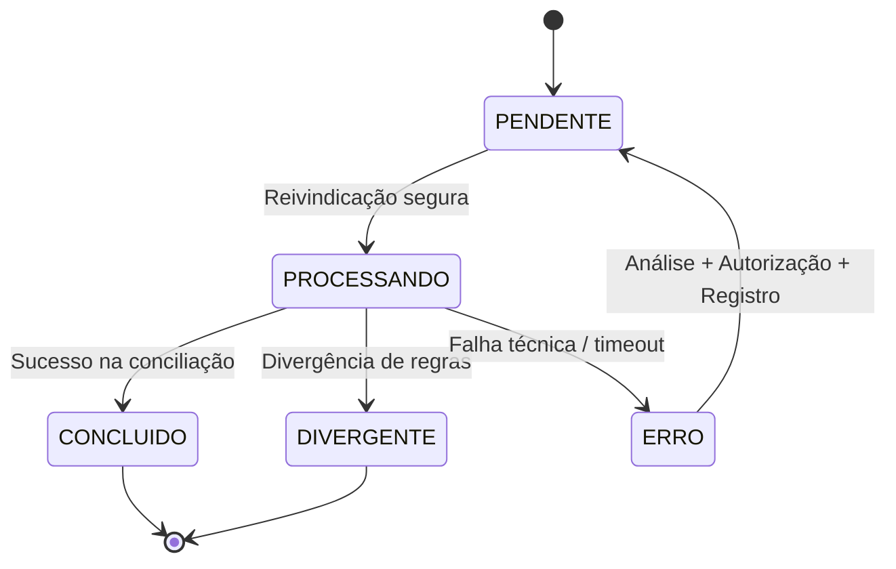
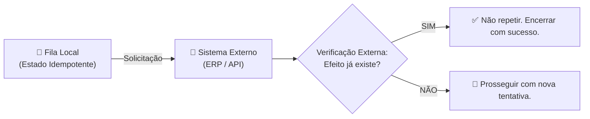
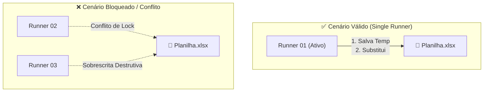

# Guia Completo de Boas Práticas, Governança e Decisões Técnicas de Automação
## Transcrição, Análise e Aplicação Prática dos Slides de Aula (Hyperautomation & Smart Office)

**Projeto:** Conferência de Estoque e Pedidos (Capstone de Hyperautomation)  
**Organização:** LG Electronics do Brasil · AX Academy / IFAM / INOVA  
**Referência dos Slides:** Diretório [`docs/IMAGENS-AULA-DOCUMENTACAO/`](file:///c:/Users/User/Documents/projects/hyperauto/exercicio-git-hyperautomation/docs/IMAGENS-AULA-DOCUMENTACAO)  
**Versão:** 1.0.0 | **Data:** 31/08/2026  

---

## 📑 Sumário Executivo

Este documento consolida e estrutura **todos os 29 slides/imagens da aula de Documentação, Migração e Governança de Automações**. Cada seção detalha o conteúdo de um slide, apresentando sua transcrição na íntegra, diagramas conceituais (Mermaid), matrizes de decisão e a aplicação direta no ecossistema de Hyperautomation do projeto (migração de **BotCity Orchestrator → Smart Office** e arquitetura de conciliação de pedidos/estoque).

---

## Índice das Seções

1. [Slide 01 — O reflexo de reescrever tudo é o primeiro risco](#1-slide-01--o-reflexo-de-reescrever-tudo-é-o-primeiro-risco)
2. [Slide 02 — A migração altera o caminho até a produção](#2-slide-02--a-migração-altera-o-caminho-até-a-produção)
3. [Slide 03 — Cinco perguntas classificam qualquer componente](#3-slide-03--cinco-perguntas-classificam-qualquer-componente)
4. [Slide 04 — O diagnóstico superficial não é executável](#4-slide-04--o-diagnóstico-superficial-não-é-executável)
5. [Slide 05 — Inventário técnico responde: o que existe e por quê?](#5-slide-05--inventário-técnico-responde-o-que-existe-e-por-quê)
6. [Slide 06 — Critérios de aceite evitam migração por suposição](#6-slide-06--critérios-de-aceite-evitam-migração-por-suposição)
7. [Slide 07 — A competência final é defender limites com evidências](#7-slide-07--a-competência-final-é-defender-limites-com-evidências)
8. [Slide 08 — Três aulas convertem baseline em operação controlada](#8-slide-08--três-aulas-convertem-baseline-em-operação-controlada)
9. [Slide 09 — O produto integra pacote e evidências](#9-slide-09--o-produto-integra-pacote-e-evidências)
10. [Slide 10 — A raiz do .zip é uma condição confirmada](#10-slide-10--a-raiz-do-zip-é-uma-condição-confirmada)
11. [Slide 11 & 12 — O entrypoint deve coordenar, não concentrar regras](#11-slide-11--12--o-entrypoint-deve-coordenar-não-concentrar-regras)
12. [Slide 13 — A Clínica da Release revela se o candidato está pronto](#12-slide-13--a-clínica-da-release-revela-se-o-candidato-está-pronto)
13. [Slide 14 — Validação estrutural detecta erros básicos](#13-slide-14--validação-estrutural-detecta-erros-básicos)
14. [Slide 15 — Manifesto e hash criam Identidade para o arquivo](#14-slide-15--manifesto-e-hash-criam-identidade-para-o-arquivo)
15. [Slide 16 — Auditoria transforma revisão em decisão técnica](#15-slide-16--auditoria-transforma-revisão-em-decisão-técnica)
16. [Slide 17 — Pré-requisitos operacionais precisam ser confirmados](#16-slide-17--pré-requisitos-operacionais-precisam-ser-confirmados)
17. [Slide 18 — Registro de upload mantém a cadeia de rastreabilidade](#17-slide-18--registro-de-upload-mantém-a-cadeia-de-rastreabilidade)
18. [Slide 19 — Waiting Runner é evidência operacional, não defeito](#18-slide-19--waiting-runner-é-evidência-operacional-não-defeito)
19. [Slide 20 — Triagem evita mudanças simultâneas](#19-slide-20--triagem-evita-mudanças-simultâneas)
20. [Slide 21 — O problema não é executar de novo, é repetir efeitos](#20-slide-21--o-problema-não-é-executar-de-novo-é-repetir-efeitos)
21. [Slide 22 — Success técnico não substitui resultado de negócio](#21-slide-22--success-técnico-não-substitui-resultado-de-negócio)
22. [Slide 23 — Uma fila é um contrato de controle, não uma tela](#22-slide-23--uma-fila-é-um-contrato-de-controle-não-uma-tela)
23. [Slide 24 — Transições permitidas protegem a integridade](#23-slide-24--transições-permitidas-protegem-a-integridade)
24. [Slide 25 — Idempotência reduz risco, mas não prova o efeito externo](#24-slide-25--idempotência-reduz-risco-mas-não-prova-o-efeito-externo)
25. [Slide 26 — Valide o esquema antes de processar itens](#25-slide-26--valide-o-esquema-antes-de-processar-itens)
26. [Slide 27 & 28 — Selecione somente pendentes e preserve identidade](#26-slide-27--28--selecione-somente-pendentes-e-preserve-identidade)
27. [Slide 29 — Gravação controlada não torna a planilha concorrente](#27-slide-29--gravação-controlada-não-torna-a-planilha-concorrente)

---

## 1. Slide 01 — O reflexo de reescrever tudo é o primeiro risco
**Arquivo:** [`WhatsApp Image 2026-08-31 at 5.00.50 PM.jpeg`](file:///c:/Users/User/Documents/projects/hyperauto/exercicio-git-hyperautomation/docs/IMAGENS-AULA-DOCUMENTACAO/WhatsApp%20Image%202026-08-31%20at%205.00.50%20PM.jpeg)

### 📌 Conteúdo do Slide
- **Conceito Chave:** *Decisões Baseadas em Evidências*
- **Premissas:**
  1. O processo e as regras de negócio geralmente permanecem válidos.
  2. Antes de editar qualquer arquivo, a equipe deve responder: **o que preservar, adaptar ou validar?**
  3. Qual evidência sustenta cada decisão técnica?
  4. Evitar a reescrita prematura protege a estabilidade do projeto.
- **Fluxo de Decisão:**
  - Código Legado/Depreciado ➔ Alerta de **Reescrita Prematura** ➔ 🛑 **PARE** (Alto Risco: instabilidade, retrabalho, perda de conhecimento).
  - Triagem em 3 vertentes: **Preservar**, **Adaptar** ou **Validar**.
  - Consolidação na **Matriz de Decisão** (Decisão, Evidência, Impacto).
  - Resultado: **Decisões Seguras** (Estabilidade, previsibilidade e valor contínuo).



### 💡 Aplicação no Projeto
- **Preservar:** Regras de negócio de conciliação de pedidos `RN01–RN12` e scripts de integração legados com o cliente Windows.
- **Adaptar:** Métodos de disparo de orquestração e empacotamento para o padrão do Smart Office.
- **Validar:** Comparações automáticas entre os resultados do BotCity e do Smart Office durante o período de Shadow Mode.

---

## 2. Slide 02 — A migração altera o caminho até a produção
**Arquivo:** [`WhatsApp Image 2026-08-31 at 5.00.51 PM.jpeg`](file:///c:/Users/User/Documents/projects/hyperauto/exercicio-git-hyperautomation/docs/IMAGENS-AULA-DOCUMENTACAO/WhatsApp%20Image%202026-08-31%20at%205.00.51%20PM.jpeg)

### 📌 Conteúdo do Slide
- **Conceito Chave:** *O Novo Fluxo Operacional*
- **Premissas:**
  - O núcleo de negócio pode permanecer intacto, mas o caminho até a produção muda.
- **Etapas do Fluxo Confirmado no Smart Office:**
  1. **Projeto Python:** Código estruturado com `bot.py` e `requirements.txt`.
  2. **Empacotamento:** Geração do pacote `.zip`.
  3. **Automation e Execução:** Criação de *Automation* ➔ Disparo de *Task* ➔ Execução em um *Runner*.
  4. **Logs e Schedule:** Observabilidade em tempo real e agendamento por *Schedule*.
- **Macro Fases:**
  - `Do Código ao Pacote` ➔ `Execução Confiável` ➔ `Observabilidade e Controle`.



---

## 3. Slide 03 — Cinco perguntas classificam qualquer componente
**Arquivo:** [`WhatsApp Image 2026-08-31 at 5.00.51 PM (1).jpeg`](file:///c:/Users/User/Documents/projects/hyperauto/exercicio-git-hyperautomation/docs/IMAGENS-AULA-DOCUMENTACAO/WhatsApp%20Image%202026-08-31%20at%205.00.51%20PM%20%281%29.jpeg)

### 📌 Conteúdo do Slide
- **Conceito Chave:** *Critérios de Classificação Arquitetural*
- **As 5 Perguntas:**

| # | Pergunta Orientadora | Camada de Destino |
| :---: | :--- | :--- |
| **1** | Descreve por que ou quando agir? | 🎯 **NEGÓCIO** |
| **2** | Executa regra, lê dados ou interage? | ⚙️ **AUTOMAÇÃO** |
| **3** | Organiza, testa ou configura o projeto? | 💻 **ENGENHARIA** |
| **4** | Publica, agenda ou monitora na plataforma? | 📅 **ORQUESTRAÇÃO** |
| **5** | Se cruza camadas, registre a principal e a interface, sem forçar classificações artificiais. | 📑 **CLASSIFICAÇÃO INTELIGENTE** |

---

## 4. Slide 04 — O diagnóstico superficial não é executável
**Arquivo:** [`WhatsApp Image 2026-08-31 at 5.00.51 PM (2).jpeg`](file:///c:/Users/User/Documents/projects/hyperauto/exercicio-git-hyperautomation/docs/IMAGENS-AULA-DOCUMENTACAO/WhatsApp%20Image%202026-08-31%20at%205.00.51%20PM%20%282%29.jpeg)

### 📌 Conteúdo do Slide
- **Conceito Chave:** *Opinião vs. Inventário Técnico Estruturado*
- **Problema:** Dizer apenas *"Python fica, BotCity sai"* é uma conclusão correta, mas **não executável**.
  - Não informa quais arquivos serão preservados ou onde existe acoplamento.
  - Não define quais testes devem ser repetidos ou o que depende de validação.
- **Solução:** Transformar opinião em um **Inventário Técnico Estruturado** contemplando:
  - `ARQUIVOS`: Listagem de arquivos e dependências associadas.
  - `ACOPLAMENTO`: Mapeamento de integrações e dependências críticas.
  - `TESTES`: Testes impactados e critérios de repetição.
  - `VALIDAÇÕES`: Itens que dependem de validação adicional.
  - `IMPACTO`: Áreas impactadas e prioridades.
  - `AÇÕES`: Plano de execução e próximos passos.

---

## 5. Slide 05 — Inventário técnico responde: o que existe e por quê?
**Arquivo:** [`WhatsApp Image 2026-08-31 at 5.00.51 PM (3).jpeg`](file:///c:/Users/User/Documents/projects/hyperauto/exercicio-git-hyperautomation/docs/IMAGENS-AULA-DOCUMENTACAO/WhatsApp%20Image%202026-08-31%20at%205.00.51%20PM%20%283%29.jpeg)

### 📌 Conteúdo do Slide
- **Conceito Chave:** *Mapeamento Estruturado do Ambiente*
- **Diretrizes:**
  - Um inventário útil não é apenas uma lista de arquivos.
  - Cada componente deve registrar: localização, responsabilidade e dependências.
  - Deve incluir a evidência de funcionamento, a camada correspondente e a decisão preliminar.
  - Transforma a opinião (*"acho que muda"*) em um plano de ação rastreável.
- **Campos Obrigatórios da Tabela de Inventário:**
  1. `LOCALIZAÇÃO` (ex: `/sistemas/erp`, `cloud/aws/s3`, `repos/app-pedidos`, `db/postgres`)
  2. `RESPONSABILIDADE` (ex: Squad Pedidos, Equipe Infraestrutura, Equipe Dados)
  3. `DEPENDÊNCIAS` (ex: APIs fiscais, RabbitMQ, S3, ETL)
  4. `EVIDÊNCIA DE FUNCIONAMENTO` (ex: Health Check OK, Logs OK, Testes OK, Backup OK)
  5. `CAMADA` (ex: Aplicação, Infraestrutura, Dados, Borda)
  6. `DECISÃO PRELIMINAR` (ex: Manter, Otimizar, Migrar)

---

## 6. Slide 06 — Critérios de aceite evitam migração por suposição
**Arquivo:** [`WhatsApp Image 2026-08-31 at 5.00.58 PM.jpeg`](file:///c:/Users/User/Documents/projects/hyperauto/exercicio-git-hyperautomation/docs/IMAGENS-AULA-DOCUMENTACAO/WhatsApp%20Image%202026-08-31%20at%205.00.58%20PM.jpeg)

### 📌 Conteúdo do Slide
- **Conceito Chave:** *Validação Antes da Execução*
- **Checklist de Prontidão (Gates de Qualidade):**
  - [x] **Baseline identificada:** Versão estável do código e histórico conhecido.
  - [x] **Testes registrados:** Casos de teste funcionais e unitários validados.
  - [x] **Ponto de entrada localizado:** Arquivo `bot.py` definido e limpo.
  - [x] **Dependências mapeadas:** Arquivo `requirements.txt` explícito e sem conflitos.
  - [x] **Riscos bloqueadores tratados:** Riscos de infraestrutura e dependências externas mitigados.
  - [x] **Arquitetura-alvo aprovada:** Desenho de execução alinhado com a governança.
- **🔒 Regra de Ouro:** *Nenhum segredo (credencial, token, senha) incluído nos artefatos de entrega.*

---

## 7. Slide 07 — A competência final é defender limites com evidências
**Arquivo:** [`WhatsApp Image 2026-08-31 at 5.00.58 PM (1).jpeg`](file:///c:/Users/User/Documents/projects/hyperauto/exercicio-git-hyperautomation/docs/IMAGENS-AULA-DOCUMENTACAO/WhatsApp%20Image%202026-08-31%20at%205.00.58%20PM%20%281%29.jpeg)

### 📌 Conteúdo do Slide
- **Conceito Chave:** *O Valor da Engenharia Profissional*
- **Fundamentos:**
  - Uma migração profissional não se mede pela quantidade de mudanças realizadas.
  - Mede-se pela capacidade de **separar responsabilidades** e **sustentar decisões**.
  - Reconhecer incertezas e preservar a lógica de negócio já aprovada é fundamental.
  - O sucesso é entregar uma automação segura, auditável e pronta para a nova operação.
- **Destaque:**
  > *"Engenharia profissional não é sobre fazer mais. É sobre sustentar o que realmente importa."*
- **Pilares Protegidos por Evidências:** `LIMITES` • `RESPONSABILIDADES` • `DECISÕES` • `GOVERNANÇA`.

---

## 8. Slide 08 — Três aulas convertem baseline em operação controlada
**Arquivo:** [`WhatsApp Image 2026-08-31 at 5.00.59 PM.jpeg`](file:///c:/Users/User/Documents/projects/hyperauto/exercicio-git-hyperautomation/docs/IMAGENS-AULA-DOCUMENTACAO/WhatsApp%20Image%202026-08-31%20at%205.00.59%20PM.jpeg)

### 📌 Conteúdo do Slide
- **Conceito Chave:** *Estrutura do Capítulo de Release e Publicação*
- **Jornada de Aprendizado / Execução:**
  1. **Aula 4 (Prepara a Release):** Entrypoint, dependências, configuração e teste local.
  2. **Aula 5 (Constrói e Audita o Pacote `.zip`):** Inspeção, manifesto, hash e validação estrutural.
  3. **Aula 6 (Republica e Executa):** Automation, Task, Runner, Logs e Schedule.
- **Fluxo Contínuo:**
  - `CÓDIGO APROVADO` ➔ `PACOTE GERADO` ➔ `VERIFICAÇÃO REALIZADA` ➔ `OPERAÇÃO EXECUTADA`.
  - Atributos entregues: **Segura**, **Rastreável**, **Auditável** e **Confiável**.

---

## 9. Slide 09 — O produto integra pacote e evidências
**Arquivo:** [`WhatsApp Image 2026-08-31 at 5.00.59 PM (1).jpeg`](file:///c:/Users/User/Documents/projects/hyperauto/exercicio-git-hyperautomation/docs/IMAGENS-AULA-DOCUMENTACAO/WhatsApp%20Image%202026-08-31%20at%205.00.59%20PM%20%281%29.jpeg)

### 📌 Conteúdo do Slide
- **Conceito Chave:** *Entregáveis do Pacote de Republicação*
- **Diretrizes:**
  - O Pacote de Republicação **não é apenas um arquivo `.zip` solto**.
  - É um dossiê integrado que reúne:
    1. **Baseline Aprovada** (código versionado e homologado).
    2. **Pacote Validado** (arquivo comprimido nos padrões exigidos).
    3. **Manifesto com Hash** (`manifest.json` com SHA-256 e metadata).
    4. **Automation Criada** (evidência de cadastro no orquestrador).
    5. **Execução da Task** (evidência de disparo de teste no Runner).
    6. **Logs** (registro textual da execução).
    7. **Relatório do Smoke Test** (prova de conformidade técnica e de negócio).
    8. **Parecer da Revisão por Pares** (aprovação formal da equipe).

---

## 10. Slide 10 — A raiz do .zip é uma condição confirmada
**Arquivo:** [`WhatsApp Image 2026-08-31 at 5.00.59 PM (2).jpeg`](file:///c:/Users/User/Documents/projects/hyperauto/exercicio-git-hyperautomation/docs/IMAGENS-AULA-DOCUMENTACAO/WhatsApp%20Image%202026-08-31%20at%205.00.59%20PM%20%282%29.jpeg)

### 📌 Conteúdo do Slide
- **Conceito Chave:** *Estrutura Obrigatória do Pacote `.zip`*
- **Regras Arquiteturais:**
  - O Runner do Smart Office exige `bot.py` e `requirements.txt` **diretamente na raiz** do `.zip`.
  - Módulos adicionais (como `src/`, `config/`, `bots/`) podem existir como subpastas.
  - **Crítico:** Os arquivos de entrada não podem ficar escondidos dentro de uma subpasta raiz adicional (ex: evitar criar `meu-projeto/bot.py` dentro do zip; deve ser diretamente `/bot.py`).

```
📦 pacote_automacao.zip
 ├── 📄 bot.py              <-- OBRIGATÓRIO NA RAIZ
 ├── 📄 requirements.txt    <-- OBRIGATÓRIO NA RAIZ
 ├── 📁 src/
 │    └── ...
 └── 📁 config/
      └── ...
```

---

## 11. Slide 11 & 12 — O entrypoint deve coordenar, não concentrar regras
**Arquivos:** [`WhatsApp Image 2026-08-31 at 5.01.00 PM.jpeg`](file:///c:/Users/User/Documents/projects/hyperauto/exercicio-git-hyperautomation/docs/IMAGENS-AULA-DOCUMENTACAO/WhatsApp%20Image%202026-08-31%20at%205.01.00%20PM.jpeg) e [`(1).jpeg`](file:///c:/Users/User/Documents/projects/hyperauto/exercicio-git-hyperautomation/docs/IMAGENS-AULA-DOCUMENTACAO/WhatsApp%20Image%202026-08-31%20at%205.01.00%20PM%20%281%29.jpeg)

### 📌 Conteúdo do Slide
- **Conceito Chave:** *Arquitetura Limpa do `bot.py`*
- **Responsabilidades do `bot.py`:**
  - Carregar configurações (`config.yaml`), ler argumentos (`CLI / ENV`), instanciar recursos e logs.
  - Chamar o **Caso de Uso** (orquestrador de fluxo).
  - Regras de negócio permanecem **fora da entrada operacional** (isoladas em `src/domain`, `src/rules`, etc.).
  - Retornar status explícito de saída: **`exit(0)` para Sucesso**, **`exit(1)` para Erro**.
- **Princípios:** *Separação de Responsabilidades • Coordenação • Baixo Acoplamento • Alta Coesão.*



---

## 12. Slide 13 — A Clínica da Release revela se o candidato está pronto
**Arquivo:** [`WhatsApp Image 2026-08-31 at 5.01.00 PM (2).jpeg`](file:///c:/Users/User/Documents/projects/hyperauto/exercicio-git-hyperautomation/docs/IMAGENS-AULA-DOCUMENTACAO/WhatsApp%20Image%202026-08-31%20at%205.01.00%20PM%20%282%29.jpeg)

### 📌 Conteúdo do Slide
- **Conceito Chave:** *Auditoria Cruzada (Peer Review de Release)*
- **Diretrizes:**
  - Outra equipe deve conseguir identificar o commit, dependências e configurações **apenas pelas evidências fornecidas**.
  - Se uma pergunta básica não puder ser respondida, o candidato à release **não está pronto**.
  - Funciona como um *"exame de saúde"* rigoroso antes do empacotamento final.
- **Itens Auditados:**
  - [x] **Commit:** Hash fixado e rastreável (`a1b2c3d`).
  - [x] **Dependências:** `requirements.txt` com versões exatas (`pandas==2.2.2`, `numpy==1.26.4`).
  - [x] **Configurações:** Arquivos `config.yaml` e `settings.json` validados.
  - [x] **Documentação:** `README.md` e `CHANGELOG.md` atualizados.

---

## 13. Slide 14 — Validação estrutural detecta erros básicos
**Arquivo:** [`WhatsApp Image 2026-08-31 at 5.01.00 PM (3).jpeg`](file:///c:/Users/User/Documents/projects/hyperauto/exercicio-git-hyperautomation/docs/IMAGENS-AULA-DOCUMENTACAO/WhatsApp%20Image%202026-08-31%20at%205.01.00%20PM%20%283%29.jpeg)

### 📌 Conteúdo do Slide
- **Conceito Chave:** *Limites da Automação e Validação Estrutural*
- **O que a Validação Estrutural faz:**
  - Verifica a presença de arquivos obrigatórios na raiz.
  - Bloqueia diretórios proibidos (`.git/`, `__pycache__/`, `venv/`) e arquivos sensíveis (`.env`, chaves privadas).
- **O que ela NÃO faz:**
  - Não prova que o código executará sem erros de runtime no Runner.
- **Alerta de Governança:**
  > ⚠️ *Validação estrutural é necessária, mas não suficiente para garantir o sucesso operacional.*

---

## 14. Slide 15 — Manifesto e hash criam Identidade para o arquivo
**Arquivo:** [`WhatsApp Image 2026-08-31 at 5.01.01 PM.jpeg`](file:///c:/Users/User/Documents/projects/hyperauto/exercicio-git-hyperautomation/docs/IMAGENS-AULA-DOCUMENTACAO/WhatsApp%20Image%202026-08-31%20at%205.01.01%20PM.jpeg)

### 📌 Conteúdo do Slide
- **Conceito Chave:** *Rastreabilidade Inviolável com Criptografia*
- **Fundamentos:**
  - O **Manifesto** vincula a versão do pacote ao commit original e ao responsável.
  - O **Hash SHA-256** identifica a assinatura exata dos bytes do arquivo `.zip`.
  - Se qualquer byte interno for modificado, o hash muda imediatamente.
  - Garante que o pacote testado seja **rigorosamente o mesmo pacote publicado** em produção.
- **Campos do Manifesto:**
  - `VERSÃO DO PACOTE`: ex. `1.4.2`
  - `COMMIT ORIGINAL`: ex. `a1b2c3d4e5f6g7h8i0j0`
  - `RESPONSÁVEL`: ex. `joao.silva@example.com`
  - `DATA/HORA`: ex. `2026-08-20 14:32:00 UTC`
  - `HASH SHA-256`: ex. `7E5A8699...`

---

## 15. Slide 16 — Auditoria transforma revisão em decisão técnica
**Arquivo:** [`WhatsApp Image 2026-08-31 at 5.01.01 PM (1).jpeg`](file:///c:/Users/User/Documents/projects/hyperauto/exercicio-git-hyperautomation/docs/IMAGENS-AULA-DOCUMENTACAO/WhatsApp%20Image%202026-08-31%20at%205.01.01%20PM%20%281%29.jpeg)

### 📌 Conteúdo do Slide
- **Conceito Chave:** *O Parecer Técnico de Homologação*
- **Diretrizes:**
  - O parecer formal checa estrutura, segurança e rastreabilidade do pacote.
  - Comentários no parecer devem indicar bloqueios, riscos e correções obrigatórias.
  - Transforma uma simples revisão superficial em uma **decisão técnica fundamentada**.
  - Garante que apenas pacotes seguros e validados avancem para o upload no Smart Office.

---

## 16. Slide 17 — Pré-requisitos operacionais precisam ser confirmados
**Arquivo:** [`WhatsApp Image 2026-08-31 at 5.01.01 PM (2).jpeg`](file:///c:/Users/User/Documents/projects/hyperauto/exercicio-git-hyperautomation/docs/IMAGENS-AULA-DOCUMENTACAO/WhatsApp%20Image%202026-08-31%20at%205.01.01%20PM%20%282%29.jpeg)

### 📌 Conteúdo do Slide
- **Conceito Chave:** *Checklist Operacional Pré-Upload*
- **Os 5 Pré-requisitos Obrigatórios:**
  1. 👤 **Autorização de Acesso:** Credenciais e permissões confirmadas no ambiente Smart Office.
  2. ⚙️ **Runner Disponível:** Máquina de execução ativa, configurada e destinada à atividade.
  3. 🗄️ **Janela de Execução e Dados de Teste:** Janela horária liberada e base de teste autorizada.
  4. 🏷️ **Owner e Nomenclatura:** Responsável técnico identificado e convenção de nomes validada.
  5. ⚠️ **Política de Parâmetros e Falhas:** Parâmetros definidos e plano de contingência aprovado.

---

## 17. Slide 18 — Registro de upload mantém a cadeia de rastreabilidade
**Arquivo:** [`WhatsApp Image 2026-08-31 at 5.01.02 PM.jpeg`](file:///c:/Users/User/Documents/projects/hyperauto/exercicio-git-hyperautomation/docs/IMAGENS-AULA-DOCUMENTACAO/WhatsApp%20Image%202026-08-31%20at%205.01.02%20PM.jpeg)

### 📌 Conteúdo do Slide
- **Conceito Chave:** *Documentando a Operação (Log de Rastreabilidade)*
- **Diretrizes:**
  - O registro imediato do upload é essencial para a cadeia de custódia.
  - Deve conter: *Automation, Versão, Owner, Nome do `.zip`, SHA-256, Commit/Tag e Data*.
  - Registrar os nomes dos parâmetros configurados (ex: `environment`, `region`, `notification_email`).
- **🔒 Regra de Ouro:** *Nunca anote valores sensíveis (senhas, tokens de API) no formulário ou em capturas de tela. Utilize mascaramento `*****`.*

---

## 18. Slide 19 — Waiting Runner é evidência operacional, não defeito
**Arquivo:** [`WhatsApp Image 2026-08-31 at 5.01.02 PM (1).jpeg`](file:///c:/Users/User/Documents/projects/hyperauto/exercicio-git-hyperautomation/docs/IMAGENS-AULA-DOCUMENTACAO/WhatsApp%20Image%202026-08-31%20at%205.01.02%20PM%20%281%29.jpeg)

### 📌 Conteúdo do Slide
- **Conceito Chave:** *Diagnóstico de Infraestrutura vs. Código*
- **Premissas:**
  - O status **`Waiting Runner`** indica que a máquina de execução não está pronta, ocupada ou desconectada.
  - **NÃO é um bug no código Python nem no pacote `.zip`**.
  - Ação correta: Verificar se o Runner correto foi selecionado e se o Runner Client está em execução no host.
  - **Alerta:** *Nunca altere o código-fonte para tentar corrigir um problema puramente operacional ou de infraestrutura.*



---

## 19. Slide 20 — Triagem evita mudanças simultâneas
**Arquivo:** [`WhatsApp Image 2026-08-31 at 5.01.02 PM (2).jpeg`](file:///c:/Users/User/Documents/projects/hyperauto/exercicio-git-hyperautomation/docs/IMAGENS-AULA-DOCUMENTACAO/WhatsApp%20Image%202026-08-31%20at%205.01.02%20PM%20%282%29.jpeg)

### 📌 Conteúdo do Slide
- **Conceito Chave:** *Investigação Estruturada de Problemas*
- **Diretrizes:**
  - Diferentes problemas (pacote, dependência, configuração, aplicação) produzem sinais distintos.
  - **Não faça várias alterações simultâneas** no código e no ambiente (impede saber o que causou o efeito).
  - Registre a hipótese e escolha a menor mudança atômica capaz de testá-la.
  - Gere uma nova release se o código mudar e preserve a evidência da tentativa anterior.
- **Lema:** *"Triar é isolar para resolver. Uma mudança por vez. Evidência sempre."*
- **Etapas:** `ISOLAR` ➔ `TESTAR` ➔ `COMPROVAR` ➔ `REGISTRAR`.

---

## 20. Slide 21 — O problema não é executar de novo, é repetir efeitos
**Arquivo:** [`WhatsApp Image 2026-08-31 at 5.01.02 PM (3).jpeg`](file:///c:/Users/User/Documents/projects/hyperauto/exercicio-git-hyperautomation/docs/IMAGENS-AULA-DOCUMENTACAO/WhatsApp%20Image%202026-08-31%20at%205.01.02%20PM%20%283%29.jpeg)

### 📌 Conteúdo do Slide
- **Conceito Chave:** *Risco de Efeitos Colaterais e Duplicação Industrial*
- **A Questão Mobilizadora:**
  - Se o orquestrador não controla rigorosamente os itens pendentes, processados e com erro, uma nova execução pode **repetir uma operação industrial já concluída**.
  - Ler novamente desperdiça tempo; atualizar novamente **duplica efeitos** (ex: faturamento duplicado, movimentação de estoque indevida).
  - O sistema deve garantir que itens concluídos nunca sejam selecionados novamente.



---

## 21. Slide 22 — Success técnico não substitui resultado de negócio
**Arquivo:** [`WhatsApp Image 2026-08-31 at 5.01.03 PM.jpeg`](file:///c:/Users/User/Documents/projects/hyperauto/exercicio-git-hyperautomation/docs/IMAGENS-AULA-DOCUMENTACAO/WhatsApp%20Image%202026-08-31%20at%205.01.03%20PM.jpeg)

### 📌 Conteúdo do Slide
- **Conceito Chave:** *A Validação Final (Técnica vs. Negócio)*
- **Diretrizes:**
  - O status `SUCCESS` no orquestrador indica apenas que o script Python executou sem exceptions não tratadas (`exit 0`).
  - **Isso não prova que o negócio foi atendido corretamente** (ex: o robô pode rodar com sucesso e não encontrar nenhum pedido devido a um filtro incorreto).
  - A aprovação final exige **conferência de saída e validação do resultado real de negócio**.

| Nível de Validação | O que avalia? | Critério de Sucesso |
| :--- | :--- | :--- |
| **1. Validação Técnica (Smoke Test)** | Execução do script, conectividade, Runner | `Status: SUCCESS` sem crash |
| **2. Validação de Negócio** | Relatório gerado, dados conferidos, regras aplicadas | Relatório de conciliação correto e aprovado |

---

## 22. Slide 23 — Uma fila é um contrato de controle, não uma tela
**Arquivo:** [`WhatsApp Image 2026-08-31 at 5.01.03 PM (1).jpeg`](file:///c:/Users/User/Documents/projects/hyperauto/exercicio-git-hyperautomation/docs/IMAGENS-AULA-DOCUMENTACAO/WhatsApp%20Image%202026-08-31%20at%205.01.03%20PM%20%281%29.jpeg)

### 📌 Conteúdo do Slide
- **Conceito Chave:** *Responsabilidades Essenciais de uma Fila de Trabalho*
- **Fundamentos:**
  - *DataPool, planilha de controle ou banco de dados são apenas detalhes de implementação.*
  - O verdadeiro valor está no **Contrato de Controle**:
    - **Identidade:** Quem pode entrar na fila e com qual identificador único.
    - **Seleção:** Como os itens são selecionados e em qual ordem de prioridade.
    - **Reivindicação (*Lease/Lock*):** Como um executor assume o item de forma exclusiva.
    - **Classificação:** Como o item é categorizado, priorizado e roteado.
  - **Garantias Obrigatórias:** Auditoria, retomada segura após falhas e prevenção absoluta de duplicidade.

---

## 23. Slide 24 — Transições permitidas protegem a integridade
**Arquivo:** [`WhatsApp Image 2026-08-31 at 5.01.04 PM.jpeg`](file:///c:/Users/User/Documents/projects/hyperauto/exercicio-git-hyperautomation/docs/IMAGENS-AULA-DOCUMENTACAO/WhatsApp%20Image%202026-08-31%20at%205.01.04%20PM.jpeg)

### 📌 Conteúdo do Slide
- **Conceito Chave:** *Máquina de Estados Finita e Segura*
- **Regras de Transição:**
  - `pendente` ➔ reivindicado para `processando`.
  - `processando` ➔ finaliza em `concluido`, `divergente` ou `erro`.
  - `erro` ➔ só pode retornar para `pendente` após **análise técnica, autorização explícita e registro de auditoria**.
  - **Bloqueio Incondicional:** Transições informais (ex: `concluido` ➔ `pendente`) são estritamente proibidas para evitar reprocessamentos acidentais.



---

## 24. Slide 25 — Idempotência reduz risco, mas não prova o efeito externo
**Arquivo:** [`WhatsApp Image 2026-08-31 at 5.01.04 PM (1).jpeg`](file:///c:/Users/User/Documents/projects/hyperauto/exercicio-git-hyperautomation/docs/IMAGENS-AULA-DOCUMENTACAO/WhatsApp%20Image%202026-08-31%20at%205.01.04%20PM%20%281%29.jpeg)

### 📌 Conteúdo do Slide
- **Conceito Chave:** *Limites do Controle Local vs. Sistemas Externos*
- **Princípios:**
  - **Idempotência:** Capacidade de repetir a tentativa sem provocar efeitos indevidos acumulados.
  - Atualizar o estado da fila local reduz duplicidade interna, mas não garante que o sistema externo (ERP, CRM, API) concluiu a transação.
  - Operações irreversíveis exigem **chave de negócio única** (*idempotency key*) ou **consulta prévia de existência** antes do reenvio.



---

## 25. Slide 26 — Valide o esquema antes de processar itens
**Arquivo:** [`WhatsApp Image 2026-08-31 at 5.01.04 PM (2).jpeg`](file:///c:/Users/User/Documents/projects/hyperauto/exercicio-git-hyperautomation/docs/IMAGENS-AULA-DOCUMENTACAO/WhatsApp%20Image%202026-08-31%20at%205.01.04%20PM%20%282%29.jpeg)

### 📌 Conteúdo do Slide
- **Conceito Chave:** *Prevenção de Falhas Silenciosas com Validação de Schema*
- **Diretrizes:**
  - Antes de iterar sobre qualquer planilha ou arquivo, validar a existência da **aba obrigatória** e todos os **cabeçalhos esperados** (`ID`, `DATA`, `CLIENTE`, `PRODUTO`, `QUANTIDADE`, `VALOR`).
  - Arquivos com colunas faltantes ou corrompidas devem **abortar o processamento imediatamente** com erro estruturado.
  - Utilizar modo `read_only` (ex: `openpyxl.load_workbook(read_only=True)`) para inspeção prévia rápida e de baixo consumo de memória.

---

## 26. Slide 27 & 28 — Selecione somente pendentes e preserve identidade
**Arquivos:** [`WhatsApp Image 2026-08-31 at 5.01.05 PM.jpeg`](file:///c:/Users/User/Documents/projects/hyperauto/exercicio-git-hyperautomation/docs/IMAGENS-AULA-DOCUMENTACAO/WhatsApp%20Image%202026-08-31%20at%205.01.05%20PM.jpeg) e [`(1).jpeg`](file:///c:/Users/User/Documents/projects/hyperauto/exercicio-git-hyperautomation/docs/IMAGENS-AULA-DOCUMENTACAO/WhatsApp%20Image%202026-08-31%20at%205.01.05%20PM%20%281%29.jpeg)

### 📌 Conteúdo do Slide
- **Conceito Chave:** *Filtragem por Identidade de Domínio*
- **Premissas:**
  - A leitura deve filtrar **exclusivamente itens com status `pendente`** (ignorando `concluido`, `cancelado` ou nulos).
  - O **`item_id`** (chave de negócio) representa a identidade imutável do item, **nunca o número da linha física da planilha**.
  - O número da linha é volátil e depende do layout de armazenamento.
  - Implementar **limite de seleção (*batch limit / chunking*)** para permitir smoke tests e execuções controladas.

---

## 27. Slide 29 — Gravação controlada não torna a planilha concorrente
**Arquivo:** [`WhatsApp Image 2026-08-31 at 5.01.05 PM (2).jpeg`](file:///c:/Users/User/Documents/projects/hyperauto/exercicio-git-hyperautomation/docs/IMAGENS-AULA-DOCUMENTACAO/WhatsApp%20Image%202026-08-31%20at%205.01.05%20PM%20%282%29.jpeg)

### 📌 Conteúdo do Slide
- **Conceito Chave:** *Limites da Concorrência em Arquivos Locais/Planilhas*
- **Premissas:**
  - Salvar em arquivo temporário (`.tmp`) e realizar substituição atômica reduz o risco de corrupção em caso de queda do processo.
  - **No entanto:** Isso **não resolve o problema de múltiplos Runners concorrentes** tentando acessar o mesmo arquivo compartilhado na rede.
  - Não impede *locks* de arquivo pelo Windows nem sobreposições destrutivas de dados.
- **Conclusão:** Planilhas e arquivos locais são estruturados para **um único executor por vez**. Ambientes multi-runner exigem bancos de dados relacionais ou orquestradores de fila dedicados com suporte a *locking* distribuído.



---

## 🏁 Matriz de Rastreabilidade Geral (Slides ➔ Entregáveis do Projeto)

| Slide # | Tema Central | Impacto no Projeto Capstone | Componente no Repositório |
| :---: | :--- | :--- | :--- |
| **01** | Preservar vs. Adaptar | Manutenção das regras de negócio legadas | [`src/rules/`](file:///c:/Users/User/Documents/projects/hyperauto/exercicio-git-hyperautomation/src) / [`PLANO_MIGRACAO_COEXISTENCIA.md`](file:///c:/Users/User/Documents/projects/hyperauto/exercicio-git-hyperautomation/docs/PLANO_MIGRACAO_COEXISTENCIA.md) |
| **02** | Novo Fluxo Operacional | Definição da esteira Smart Office | [`bot.py`](file:///c:/Users/User/Documents/projects/hyperauto/exercicio-git-hyperautomation/bot.py), [`requirements.txt`](file:///c:/Users/User/Documents/projects/hyperauto/exercicio-git-hyperautomation/requirements.txt) |
| **03** | 5 Perguntas de Classificação | Separação das 4 camadas de software | [`main.py`](file:///c:/Users/User/Documents/projects/hyperauto/exercicio-git-hyperautomation/main.py), [`producer.py`](file:///c:/Users/User/Documents/projects/hyperauto/exercicio-git-hyperautomation/producer.py), [`consumer.py`](file:///c:/Users/User/Documents/projects/hyperauto/exercicio-git-hyperautomation/consumer.py) |
| **04-05** | Inventário Técnico | Mapeamento estruturado de componentes | [`docs/pdd/PDD_Process_Design_Document.md`](file:///c:/Users/User/Documents/projects/hyperauto/exercicio-git-hyperautomation/docs/pdd/PDD_Process_Design_Document.md) |
| **06-07** | Critérios de Aceite e Limites | Validação prévia e segurança de segredos | [`pytest.ini`](file:///c:/Users/User/Documents/projects/hyperauto/exercicio-git-hyperautomation/pytest.ini), [`.env.example`](file:///c:/Users/User/Documents/projects/hyperauto/exercicio-git-hyperautomation/.env.example) |
| **08-09** | Release e Pacote Integrado | Dossiê completo com hash e smoke test | [`docs/PLANO_MIGRACAO_COEXISTENCIA.md`](file:///c:/Users/User/Documents/projects/hyperauto/exercicio-git-hyperautomation/docs/PLANO_MIGRACAO_COEXISTENCIA.md) |
| **10** | Raiz do .zip | Garantia de `bot.py` e `requirements.txt` na raiz | Script de build / empacotamento `.zip` |
| **11-12** | Entrypoint Coordenador | `bot.py` como maestro sem regras hardcoded | [`bot.py`](file:///c:/Users/User/Documents/projects/hyperauto/exercicio-git-hyperautomation/bot.py) |
| **13-16** | Clínica da Release & Auditoria | Checklist de revisão por pares e manifestos | [`CHANGELOG.md`](file:///c:/Users/User/Documents/projects/hyperauto/exercicio-git-hyperautomation/docs/CHANGELOG.md) |
| **17-18** | Checklist & Log de Upload | Registro seguro de parâmetros sem senhas | Logs de deploy e governança |
| **19-20** | Diagnóstico & Triagem | Tratamento de `Waiting Runner` e isolamento | Observabilidade e monitoramento de runners |
| **21-25** | Fila, Estados & Idempotência | Controle de concorrência e chave única | [`producer.py`](file:///c:/Users/User/Documents/projects/hyperauto/exercicio-git-hyperautomation/producer.py), [`consumer.py`](file:///c:/Users/User/Documents/projects/hyperauto/exercicio-git-hyperautomation/consumer.py) |
| **26-28** | Validação de Schema & Filtros | Validação estrutural de planilhas e seleção | [`coletor.py`](file:///c:/Users/User/Documents/projects/hyperauto/exercicio-git-hyperautomation/coletor.py), [`src/`](file:///c:/Users/User/Documents/projects/hyperauto/exercicio-git-hyperautomation/src) |
| **29** | Limites da Concorrência | Escrita atômica e exclusividade de Runner | `CoexistenceGuard` / Lock de sessão gráfica |
