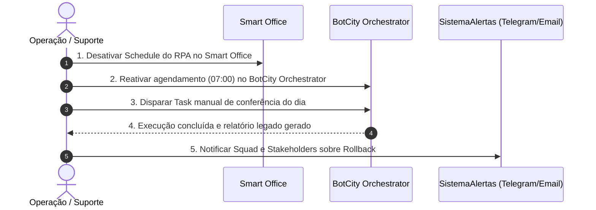

# Plano de Migração e Coexistência Operacional: BotCity Orchestrator → Smart Office

**Projeto:** Conferência de Estoque e Pedidos (Capstone de Hyperautomation)  
**Organização:** LG Electronics do Brasil · AX Academy / IFAM / Polo de Inovação (INOVA)  
**Processo:** `RPA01–RPA06` — Pipeline Híbrido Desktop + Web com Decisão RPA+ML  
**Versão:** 1.0.0 | **Data:** 28/08/2026  
**Responsável Técnico:** Squad de Hyperautomation  

---

## 1. Contexto e Justificativa da Migração

A operação de RPA da LG Electronics está em transição estratégica do **BotCity Orchestrator** legado para a plataforma corporativa **Smart Office** (*Manual de Operação, Capítulos 1–2*). 
O processo de **Conferência de Estoque e Pedidos** opera diariamente no início da manhã, extraindo dados do cliente Windows legado de estoque e cruzando com pedidos abertos. 

Como a operação não pode sofrer descontinuidade ou inconsistência de dados, a migração adota um modelo de **faseamento controlado com janela de coexistência e guarda de sessão gráfica**, evitando qualquer concorrência ou indisponibilidade de Runner.

```
                  CRONOGRAMA E FASEAMENTO DA MIGRAÇÃO
  ┌──────────────────────────────────────────────────────────────────┐
  │ Semana 1-2: Coexistência em Paralelo (Shadow Mode)               │
  │ • 07:00 -> BotCity Legado (Fonte Oficial para o Negócio)         │
  │ • 07:30 -> Smart Office (Execução Shadow & Validação Diária)     │
  │ • CoexistenceGuard: Mutex impede sobreposição no Runner          │
  └──────────────────────────────┬───────────────────────────────────┘
                                 │ Critério de Corte: 5 dias sem divergência
                                 ▼
  ┌──────────────────────────────────────────────────────────────────┐
  │ Semana 3: Cutover e Validação Pós-Deploy (Smoke Test)            │
  │ • Execução do Smoke Test automatizado (Capítulo 13)              │
  │ • Desativação do Schedule no BotCity Orchestrator                │
  │ • Ativação do Schedule oficial no Smart Office (07:00)           │
  │ • Smart Office torna-se a Fonte Oficial                          │
  └──────────────────────────────┬───────────────────────────────────┘
                                 │ Em caso de incidente crítico
                                 ▼
  ┌──────────────────────────────────────────────────────────────────┐
  │ Contingência: Plano de Rollback Imediato (RTO < 15 min, RPO = 0) │
  │ • Reativação do Schedule no BotCity Orchestrator                 │
  │ • Desativação da automação no Smart Office                       │
  │ • Notificação de contingência via Telegram / Email               │
  └──────────────────────────────────────────────────────────────────┘
```

---

## 2. Janela de Coexistência (Shadow Mode)

A coexistência ocorrerá por um período padrão de **14 dias corridos** sob as seguintes regras de governança:

1. **Fonte Oficial Durante a Transição:**
   - Os relatórios gerados pelo BotCity Orchestrator continuam sendo a fonte oficial consumida pela equipe de Operações e Qualidade.
   - O pipeline no Smart Office roda 30 minutos após o legado (às 07:30), operando em modo de auditoria passiva (*Shadow Execution*).
2. **Comparação Automática de Resultados:**
   - Um script diário de reconciliação compara a saída do Smart Office (`relatorio_conferencia_lotes.xlsx`) com o relatório do BotCity.
   - Divergências de regras ou falhas de execução são registradas no log de homologação.

---

## 3. Estratégia de Mitigação de Conflito de Runner

> [!IMPORTANT]
> **Desafio Crítico de Automação Desktop:**
> O sistema de estoque interno é uma aplicação Windows desktop sem API. A automação depende de reconhecimento de tela, foco de janela e cliques/digitação, exigindo uma **sessão gráfica ativa e exclusiva**. Se dois orquestradores tentarem acionar robôs na mesma máquina no mesmo instante, haverá roubo de foco, corrompendo a digitação e derrubando ambas as execuções.

### Mecanismos de Proteção Implementados:

1. **Separação Temporal de Agendamentos (Schedule Offset):**
   - Agendamento BotCity: `0 7 * * 1-5` (07:00).
   - Agendamento Smart Office (Shadow): `30 7 * * 1-5` (07:30).
   - Janela de segurança de 30 minutos entre os disparos.

2. **Guarda de Sessão Gráfica por Mutex (`CoexistenceGuard`):**
   - Implementado no módulo [`src/coexistence_guard.py`](file:///c:/Users/User/Documents/projects/hyperauto/exercicio-git-hyperautomation/src/coexistence_guard.py).
   - Ao iniciar, o `RPA01_ColetaEstoque_DESKTOP` tenta obter um lock exclusivo no arquivo `data/datapool/runner_session.lock`.
   - Se o BotCity legado estiver em execução na máquina, o `CoexistenceGuard` detecta o bloqueio ativo e **retém a execução**, lançando `CoexistenceConflictError` controlado, impedindo duplicidade ou roubo de tela.

3. **Priorização de Tarefas no Smart Office:**
   - O bot desktop `RPA01_ColetaEstoque_DESKTOP` possui **Prioridade 1 (Alta)** no Smart Office, garantindo que assim que o Runner dedicado estiver livre, sua tarefa seja processada imediatamente, sem ficar represada atrás de tarefas secundárias.

---

## 4. Critérios de Corte (Cutover) e Smoke Test

A virada de chave definitiva do BotCity para o Smart Office exige o cumprimento integral de **três critérios objetivos**:

| Critério de Corte | Meta Mínima Exigida | Método de Verificação |
| :--- | :--- | :--- |
| **Estabilidade Temporal** | 5 dias úteis consecutivos sem erros não tratados. | Logs do Smart Office (`Status = Success`). |
| **Acurácia e Paridade** | 100% de paridade nas regras determinísticas RN01–RN12 contra o legado. | Comparação automatizada de planilhas de saída. |
| **Validação Pós-Deploy** | 100% de aprovação no **Smoke Test de Corte**. | Execução do script `scripts/smoke_test_cutover.py`. |

### Definição do Smoke Test de Corte (Smart Office - Capítulo 13)
O Smoke Test consiste em enviar Tasks mínimas e não críticas para validar os 6 robôs do pipeline antes de liberar o agendamento em produção:

```bash
python scripts/smoke_test_cutover.py
```

* **Task 1 (Desktop):** Conecta à janela gráfica e consulta lote de teste `LOTE-001`.
* **Task 2 (Web):** Valida conectividade e leitura do arquivo de pedidos.
* **Task 3 (Consolidação):** Valida execução determinística das regras com dataset unitário.
* **Task 4 (ML):** Valida feature flag e resposta defensiva do classificador de causa provável.
* **Task 5 (Notificação):** Valida envio de alerta de teste no canal Telegram / fallback.
* **Task 6 (Dead Letter):** Valida acesso e auditoria da fila de dados corrompidos.

---

## 5. Procedimento de Rollback (Caminho de Volta)

Caso ocorra qualquer instabilidade crítica no Smart Office após o cutover (ex.: falha recorrente no Runner gráfico, bloqueio de credenciais corporativas ou corrupção de arquivos de saída), o procedimento de Rollback é acionado com **RTO < 15 minutos** e **RPO = 0**:



### Checklist Operacional de Rollback:
1. **[0–3 min]** Acessar *Smart Office Orchestrator → Schedules* e desativar o agendamento do pipeline `RPA01–RPA05`.
2. **[3–6 min]** Acessar o painel do *BotCity Orchestrator* e reativar o job diário do bot legado `bot-conferencia-v1`.
3. **[6–10 min]** Disparar execução manual no BotCity para reprocessar a carga do dia se necessário.
4. **[10–15 min]** Disparar notificação de severidade `CRITICO` aos analistas de qualidade informando que o processo retornou temporariamente ao ambiente legado para diagnóstico técnico.

---

## 6. Governança e Matriz de Responsabilidades (RACI)

| Atividade | Desenvolvedor RPA | Revisor Técnico (Sênior) | Operação / Suporte | Stakeholder de Negócio |
| :--- | :---: | :---: | :---: | :---: |
| Execução em Paralelo (Shadow) | **R** | **A** | **C** | **I** |
| Execução do Smoke Test de Corte | **R** | **A** | **I** | **I** |
| Aprovação e Ativação do Schedule | **C** | **A / R** | **I** | **I** |
| Monitoramento Diário via Logs | **C** | **C** | **R** | **I** |
| Decisão e Acionamento de Rollback | **C** | **A** | **R** | **I** |

*Legenda: **R** = Responsável pela execução; **A** = Aprovador final; **C** = Consultado; **I** = Informado.*

---

## 7. Referências e Diretrizes de Engenharia

Para aprofundamento nos critérios de aceite, auditoria cruzada, estruturação do pacote `.zip`, diagnóstico de `Waiting Runner`, idempotência de fila e governança técnica completa, consulte o **[Guia Completo de Boas Práticas e Governança de Automação (Slides da Aula)](file:///c:/Users/User/Documents/projects/hyperauto/exercicio-git-hyperautomation/docs/GUIA_AULA_DOCUMENTACAO_E_BOAS_PRATICAS.md)**.

