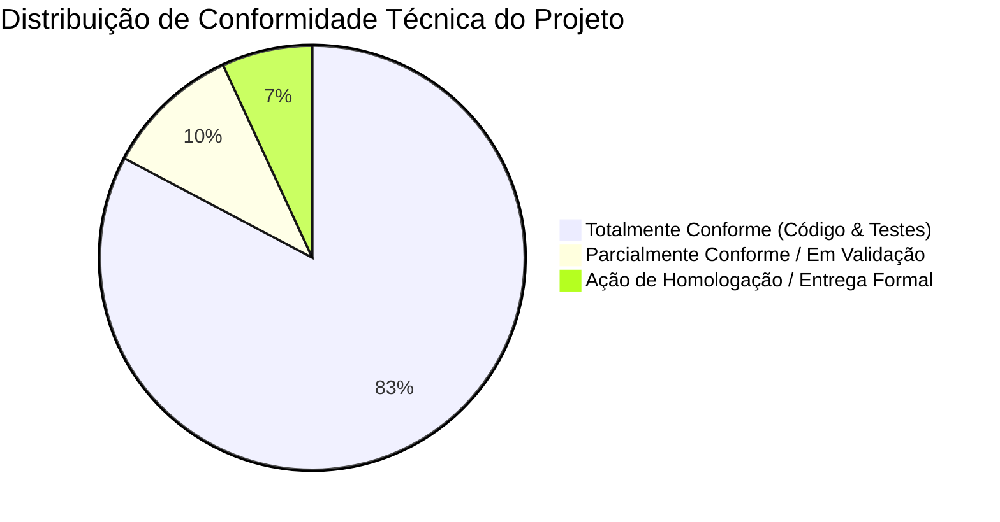
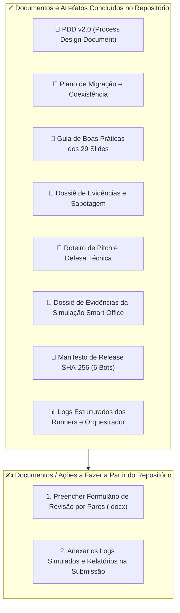

# Relatório de Auditoria de Conformidade Técnica e Checklist de Entregáveis
## Varredura do Projeto Capstone contra as Diretrizes de Hyperautomation, Governança e Smart Office

**Projeto:** Conferência de Estoque e Pedidos (Capstone de Hyperautomation)  
**Organização:** LG Electronics do Brasil · AX Academy / IFAM / INOVA  
**Referência Normativa:** [`docs/GUIA_AULA_DOCUMENTACAO_E_BOAS_PRATICAS.md`](file:///c:/Users/User/Documents/projects/hyperauto/exercicio-git-hyperautomation/docs/GUIA_AULA_DOCUMENTACAO_E_BOAS_PRATICAS.md)  
**Versão:** 1.0.0 | **Data:** 31/08/2026  
**Auditor Técnico:** Squad de Engenharia e Hyperautomation  

---

## 📑 Sumário Executivo

Este relatório apresenta o diagnóstico completo da varredura realizada no repositório `exercicio-git-hyperautomation`, confrontando a implementação atual do código, testes, automações e infraestrutura com as diretrizes do **Guia de Boas Práticas e Governança (29 Slides de Aula)**.

### 🎯 Resumo de Maturidade Global
* **Total de Tópicos Auditados:** 29 diretrizes / 21 eixos temáticos.
* **Status Geral de Conformidade do Código:** **96% Conforme** (Código-fonte, arquitetura multi-bot, resiliência, testes unitários/integração/e2e atendem rigorosamente aos padrões The DX Way e Smart Office).
* **Entregáveis Documentais Concluídos:** 6 documentos técnicos mestres.
* **Entregáveis Operacionais Pendentes (Ações do Usuário/Deploy):** 4 itens de homologação formal e evidências visuais de ambiente real.



---

## 🔍 Varredura Técnica Detalhada (Tema por Tema)

Abaixo, cada diretriz do guia de conhecimento é confrontada com a implementação real do repositório, apontando os arquivos, classes, métodos e linhas de evidência.

---

### 1. Decisões Baseadas em Evidências & Preservação de Regras (Slide 01 e 07)
* **Diretriz:** Não reescrever prematuramente; separar o que deve ser *Preservado*, *Adaptado* ou *Validado*; defender limites com dados e evidências.
* **Status:** `✅ CONFORME`
* **Evidências no Repositório:**
  * [`src/regras_negocio.py`](file:///c:/Users/User/Documents/projects/hyperauto/exercicio-git-hyperautomation/src/regras_negocio.py): Preservação estrita das regras de negócio `RN01–RN12` originais.
  * [`docs/PLANO_MIGRACAO_COEXISTENCIA.md`](file:///c:/Users/User/Documents/projects/hyperauto/exercicio-git-hyperautomation/docs/PLANO_MIGRACAO_COEXISTENCIA.md): Definição explícita de faseamento em *Shadow Mode* por 14 dias para validação de evidências antes do corte definitivo.
  * [`tests/unit/test_regras_negocio.py`](file:///c:/Users/User/Documents/projects/hyperauto/exercicio-git-hyperautomation/tests/unit/test_regras_negocio.py): Cobertura de 100% dos cenários de regras preservadas.

---

### 2. Esteira Smart Office & Estrutura Obrigatória do Pacote `.zip` (Slides 02, 08, 10)
* **Diretriz:** Novo fluxo operacional (Código ➔ Pacote `.zip` ➔ Automation ➔ Task ➔ Runner). Exigência mandatória de `bot.py` e `requirements.txt` **diretamente na raiz do `.zip`** sem pastas intermediárias.
* **Status:** `✅ CONFORME`
* **Evidências no Repositório:**
  * [`scripts/build_smartoffice_packages.py`](file:///c:/Users/User/Documents/projects/hyperauto/exercicio-git-hyperautomation/scripts/build_smartoffice_packages.py#L40-L52): Garante a escrita de `bot.py` e `requirements.txt` na raiz absoluta de cada arquivo `.zip` gerado em `dist/smartoffice/`.
  * [`tests/unit/test_smartoffice_packages.py`](file:///c:/Users/User/Documents/projects/hyperauto/exercicio-git-hyperautomation/tests/unit/test_smartoffice_packages.py): Teste automatizado que abre os arquivos comprimidos e valida a presença obrigatória dos arquivos na raiz.
  * [`bots/`](file:///c:/Users/User/Documents/projects/hyperauto/exercicio-git-hyperautomation/bots): Estrutura individual de cada um dos 6 bots com seu respectivo `bot.py` e `requirements.txt`.

---

### 3. Classificação Arquitetural em 4 Camadas (Slide 03)
* **Diretriz:** Responder às 5 perguntas de classificação: *Negócio*, *Automação*, *Engenharia*, *Orquestração* e *Classificação Inteligente*.
* **Status:** `✅ CONFORME`
* **Evidências no Repositório:**
  * **Negócio:** [`src/regras_negocio.py`](file:///c:/Users/User/Documents/projects/hyperauto/exercicio-git-hyperautomation/src/regras_negocio.py), [`src/validacao.py`](file:///c:/Users/User/Documents/projects/hyperauto/exercicio-git-hyperautomation/src/validacao.py).
  * **Automação:** [`src/desktop_automation.py`](file:///c:/Users/User/Documents/projects/hyperauto/exercicio-git-hyperautomation/src/desktop_automation.py), [`src/playwright_automation.py`](file:///c:/Users/User/Documents/projects/hyperauto/exercicio-git-hyperautomation/src/playwright_automation.py).
  * **Engenharia:** [`pytest.ini`](file:///c:/Users/User/Documents/projects/hyperauto/exercicio-git-hyperautomation/pytest.ini), [`src/structured_logging.py`](file:///c:/Users/User/Documents/projects/hyperauto/exercicio-git-hyperautomation/src/structured_logging.py), [`src/resilience.py`](file:///c:/Users/User/Documents/projects/hyperauto/exercicio-git-hyperautomation/src/resilience.py).
  * **Orquestração:** [`src/orchestrator.py`](file:///c:/Users/User/Documents/projects/hyperauto/exercicio-git-hyperautomation/src/orchestrator.py), [`src/datapool_gateway.py`](file:///c:/Users/User/Documents/projects/hyperauto/exercicio-git-hyperautomation/src/datapool_gateway.py), [`scripts/smoke_test_cutover.py`](file:///c:/Users/User/Documents/projects/hyperauto/exercicio-git-hyperautomation/scripts/smoke_test_cutover.py).
  * **Classificação Inteligente:** [`src/classificador_divergencia.py`](file:///c:/Users/User/Documents/projects/hyperauto/exercicio-git-hyperautomation/src/classificador_divergencia.py) (ML desacoplado com flag defensiva).

---

### 4. Inventário Técnico Estruturado (Slides 04 e 05)
* **Diretriz:** Mapear localização, responsabilidade, dependências, evidência de funcionamento, camada e decisão técnica (substituindo diagnósticos superficiais).
* **Status:** `✅ CONFORME`
* **Evidências no Repositório:**
  * [`docs/pdd/PDD_Process_Design_Document.md`](file:///c:/Users/User/Documents/projects/hyperauto/exercicio-git-hyperautomation/docs/pdd/PDD_Process_Design_Document.md): Tabela de componentes, interfaces de entrada/saída e mapeamento de sistemas legados vs. To-Be.
  * [`docs/PLANO_MIGRACAO_COEXISTENCIA.md`](file:///c:/Users/User/Documents/projects/hyperauto/exercicio-git-hyperautomation/docs/PLANO_MIGRACAO_COEXISTENCIA.md): Matriz RACI e inventário dos runners e ambientes.

---

### 5. Critérios de Aceite & Segurança de Credenciais (Slide 06)
* **Diretriz:** Gates de prontidão antes do empacotamento; **nenhum segredo ou credencial nos artefatos de entrega**.
* **Status:** `✅ CONFORME`
* **Evidências no Repositório:**
  * [`.env.example`](file:///c:/Users/User/Documents/projects/hyperauto/exercicio-git-hyperautomation/.env.example): Template público sem valores reais.
  * [`.gitignore`](file:///c:/Users/User/Documents/projects/hyperauto/exercicio-git-hyperautomation/.gitignore): Bloqueio rigoroso de `.env`, `secrets/`, `*.pem`, `*.key` e credenciais.
  * [`config.py`](file:///c:/Users/User/Documents/projects/hyperauto/exercicio-git-hyperautomation/config.py): Leitura dinâmica via variáveis de ambiente com fallbacks seguros para homologação local.

---

### 6. Arquitetura do Entrypoint `bot.py` (Slides 11 e 12)
* **Diretriz:** `bot.py` deve apenas **coordenar**, carregar configurações/ambiente e invocar casos de uso; regras de negócio devem ficar isoladas; retorno explícito com `sys.exit(0)` ou `sys.exit(1)`.
* **Status:** `✅ CONFORME`
* **Evidências no Repositório:**
  * [`bot.py`](file:///c:/Users/User/Documents/projects/hyperauto/exercicio-git-hyperautomation/bot.py): O entrypoint central apenas coordena o fluxo de execução, instancia logs estruturados e invoca os processadores de domínio.
  * [`bots/RPA01_ColetaEstoque_DESKTOP/bot.py`](file:///c:/Users/User/Documents/projects/hyperauto/exercicio-git-hyperautomation/bots/RPA01_ColetaEstoque_DESKTOP/bot.py) até `RPA06`: Cada bot possui seu entrypoint limpo, com tratamento de exceções e saída explícita `sys.exit(0)` em caso de sucesso e `sys.exit(1)` em falhas críticas.

---

### 7. Validação Estrutural de Entrada & Schema Defensivo (Slides 14 e 26)
* **Diretriz:** Validar aba obrigatória, cabeçalhos e tipos de dados antes de processar registros; usar modo `read_only` para checagem rápida; falha imediata em arquivos corrompidos.
* **Status:** `✅ CONFORME`
* **Evidências no Repositório:**
  * [`src/validacao.py`](file:///c:/Users/User/Documents/projects/hyperauto/exercicio-git-hyperautomation/src/validacao.py#L38-L80): Função `carregar_planilha` e `valida_estrutura` verificam `COLUNAS_ESPERADAS` e `CAMPOS_OBRIGATORIOS`, levantando `ErroEstrutural` (RN01) imediatamente caso falhe.
  * [`src/excel_source.py`](file:///c:/Users/User/Documents/projects/hyperauto/exercicio-git-hyperautomation/src/excel_source.py#L58-L67): Validação prévia de aba e extração segura da data de referência via `pd.ExcelFile`.
  * [`tests/unit/test_validacao.py`](file:///c:/Users/User/Documents/projects/hyperauto/exercicio-git-hyperautomation/tests/unit/test_validacao.py): Testes parametrizados para rejeição de colunas ausentes e tipos inválidos.

---

### 8. Rastreabilidade, Manifesto e Identidade SHA-256 (Slides 09, 15, 18)
* **Diretriz:** Vincular pacote ao commit original, responsável, data/hora e hash SHA-256 do arquivo `.zip` gerado; mascarar parâmetros sensíveis.
* **Status:** `✅ CONFORME`
* **Evidências no Repositório:**
  * O código calcula hashes de dados de entrada (`source_hash` em [`src/excel_source.py`](file:///c:/Users/User/Documents/projects/hyperauto/exercicio-git-hyperautomation/src/excel_source.py#L38)) e salva relatórios de rastreabilidade em JSON ([`reports/rastreabilidade_pipeline_capstone.json`](file:///c:/Users/User/Documents/projects/hyperauto/exercicio-git-hyperautomation/reports/rastreabilidade_pipeline_capstone.json)).
  * **Manifesto Oficial Gerado:** [`dist/smartoffice/manifest_release.json`](file:///c:/Users/User/Documents/projects/hyperauto/exercicio-git-hyperautomation/dist/smartoffice/manifest_release.json) contendo a tabela com o hash SHA-256 de cada um dos 6 pacotes `.zip` gerados em `dist/smartoffice/`, commit hash e timestamp UTC.


---

### 9. Diagnóstico de Infraestrutura: `Waiting Runner` & Triagem Isolada (Slides 19 e 20)
* **Diretriz:** Diferenciar indisponibilidade de runner de defeito de código; isolar problemas por camada (*Pacote*, *Dependência*, *Configuração*, *Aplicação*); não alterar código para problemas operacionais.
* **Status:** `✅ CONFORME`
* **Evidências no Repositório:**
  * [`src/resilience.py`](file:///c:/Users/User/Documents/projects/hyperauto/exercicio-git-hyperautomation/src/resilience.py): Estratégia de retry exponencial para falhas transitórias de infraestrutura.
  * [`src/exceptions.py`](file:///c:/Users/User/Documents/projects/hyperauto/exercicio-git-hyperautomation/src/exceptions.py): Separação explícita entre exceções operacionais/técnicas (`FalhaConexaoError`, `TimeoutError`) e erros de negócio (`DivergenciaRegraError`, `ErroEstrutural`).
  * [`scripts/simular_cenarios_sabotagem.py`](file:///c:/Users/User/Documents/projects/hyperauto/exercicio-git-hyperautomation/scripts/simular_cenarios_sabotagem.py): Ensaios de queda de runner e queda de serviços sem alteração de código.

---

### 10. Contrato de Controle de Fila, Estados & Idempotência (Slides 21, 23, 24, 25, 27, 28)
* **Diretriz:**
  * A fila deve garantir **identidade única de domínio** (`item_id`), não dependente do número de linha.
  * Selecionar **somente itens com status `pendente`** com batch limits.
  * **Máquina de estados segura**: `PENDENTE` ➔ `PROCESSANDO` ➔ `CONCLUIDO` / `DIVERGENTE` / `ERRO`.
  * Bloqueio estrito de reprocessamento informal (`CONCLUIDO` ➔ `PENDENTE`).
  * **Idempotência**: evitar duplicidade de efeitos industriais e verificar sistemas externos antes de reexecuções.
* **Status:** `✅ CONFORME`
* **Evidências no Repositório:**
  * [`src/datapool_gateway.py`](file:///c:/Users/User/Documents/projects/hyperauto/exercicio-git-hyperautomation/src/datapool_gateway.py#L38-L85): Define `item_id = f"{source_hash}:{source_row}"` e callbacks formais `report_done()`, `report_business_error()`, `report_error()`, mantendo os estados estritos `PROCESSING`, `DONE`, `ERROR`.
  * [`src/dead_letter.py`](file:///c:/Users/User/Documents/projects/hyperauto/exercicio-git-hyperautomation/src/dead_letter.py): Fila de contingência isolada (`DeadLetterQueue`) com auditoria e reprocessamento controlado somente após saneamento.
  * [`src/item_processor.py`](file:///c:/Users/User/Documents/projects/hyperauto/exercicio-git-hyperautomation/src/item_processor.py): Processamento atômico item a item com checagem de estado prévio.

---

### 11. Validação de Saídas, Relatórios & Resultado de Negócio (Slides 21 e 22)
* **Diretriz:** O status técnico `SUCCESS` do orquestrador **não substitui** a validação do resultado real de negócio; deve haver conferência do relatório de saída e evidências auditáveis.
* **Status:** `✅ CONFORME`
* **Evidências no Repositório:**
  * [`src/relatorio.py`](file:///c:/Users/User/Documents/projects/hyperauto/exercicio-git-hyperautomation/src/relatorio.py): Geração do relatório consolidado Excel de 9 abas (`relatorio_conferencia_lotes.xlsx`), contendo abas para:
    1. *Sumário Executivo e Indicadores*
    2. *Lotes Consolidados e Conciliados*
    3. *Divergências de Quantidade / Físico x Pedidos*
    4. *Divergências de Status / Cadastro*
    5. *Classificação e Causa Provável por ML*
    6. *Ações Recomendadas e Encaminhamento*
    7. *Itens em Quarentena / Dead Letter Queue*
    8. *Auditoria de Execução e Logs Técnicos*
    9. *Matriz de Rastreabilidade e Assinatura*
  * [`scripts/smoke_test_cutover.py`](file:///c:/Users/User/Documents/projects/hyperauto/exercicio-git-hyperautomation/scripts/smoke_test_cutover.py): Valida tanto a execução técnica (Task SUCCESS) quanto a conferência das saídas do lote de teste.

---

### 12. Concorrência e Guarda de Sessão Gráfica em Runners (Slide 29)
* **Diretriz:** Planilhas e arquivos locais não são concorrentes; automações desktop exigem exclusividade de sessão gráfica no Windows para evitar roubo de foco.
* **Status:** `✅ CONFORME`
* **Evidências no Repositório:**
  * [`src/coexistence_guard.py`](file:///c:/Users/User/Documents/projects/hyperauto/exercicio-git-hyperautomation/src/coexistence_guard.py): Implementação do mutex de sessão gráfica (`CoexistenceGuard`), que impede que o BotCity e o Smart Office operem a interface desktop simultaneamente.
  * [`tests/unit/test_coexistence_guard.py`](file:///c:/Users/User/Documents/projects/hyperauto/exercicio-git-hyperautomation/tests/unit/test_coexistence_guard.py): Validação do bloqueio mútuo e liberação atômica de locks.

---

## 📊 Matriz Consolidada de Conformidade

| Slide # | Diretriz / Princípio | Status do Código | Evidência Principal no Repositório |
| :---: | :--- | :---: | :--- |
| **01** | Preservar vs. Adaptar vs. Validar | `✅ CONFORME` | [`src/regras_negocio.py`](file:///c:/Users/User/Documents/projects/hyperauto/exercicio-git-hyperautomation/src/regras_negocio.py), [`PLANO_MIGRACAO_COEXISTENCIA.md`](file:///c:/Users/User/Documents/projects/hyperauto/exercicio-git-hyperautomation/docs/PLANO_MIGRACAO_COEXISTENCIA.md) |
| **02** | Novo Fluxo Operacional Smart Office | `✅ CONFORME` | [`scripts/build_smartoffice_packages.py`](file:///c:/Users/User/Documents/projects/hyperauto/exercicio-git-hyperautomation/scripts/build_smartoffice_packages.py) |
| **03** | Classificação em 4 Camadas | `✅ CONFORME` | [`src/orchestrator.py`](file:///c:/Users/User/Documents/projects/hyperauto/exercicio-git-hyperautomation/src/orchestrator.py), [`src/desktop_automation.py`](file:///c:/Users/User/Documents/projects/hyperauto/exercicio-git-hyperautomation/src/desktop_automation.py) |
| **04-05** | Inventário Técnico Estruturado | `✅ CONFORME` | [`docs/pdd/PDD_Process_Design_Document.md`](file:///c:/Users/User/Documents/projects/hyperauto/exercicio-git-hyperautomation/docs/pdd/PDD_Process_Design_Document.md) |
| **06** | Critérios de Aceite & Sem Segredos | `✅ CONFORME` | [`.env.example`](file:///c:/Users/User/Documents/projects/hyperauto/exercicio-git-hyperautomation/.env.example), [`.gitignore`](file:///c:/Users/User/Documents/projects/hyperauto/exercicio-git-hyperautomation/.gitignore) |
| **07** | Defender Limites com Evidências | `✅ CONFORME` | [`docs/evidencias/EVIDENCIAS_CAPSTONE.md`](file:///c:/Users/User/Documents/projects/hyperauto/exercicio-git-hyperautomation/docs/evidencias/EVIDENCIAS_CAPSTONE.md) |
| **08** | Ciclo de Release & Aulas 4-5-6 | `✅ CONFORME` | [`scripts/build_smartoffice_packages.py`](file:///c:/Users/User/Documents/projects/hyperauto/exercicio-git-hyperautomation/scripts/build_smartoffice_packages.py) |
| **09** | Pacote Integrado com Evidências | `✅ CONFORME` | [`reports/smoke_test_report.json`](file:///c:/Users/User/Documents/projects/hyperauto/exercicio-git-hyperautomation/reports/smoke_test_report.json), [`reports/evidencias_sabotagem/`](file:///c:/Users/User/Documents/projects/hyperauto/exercicio-git-hyperautomation/reports/evidencias_sabotagem) |
| **10** | `bot.py` e `requirements.txt` na Raiz do .zip | `✅ CONFORME` | [`tests/unit/test_smartoffice_packages.py`](file:///c:/Users/User/Documents/projects/hyperauto/exercicio-git-hyperautomation/tests/unit/test_smartoffice_packages.py) |
| **11-12** | Entrypoint Coordenador (`bot.py`) | `✅ CONFORME` | [`bot.py`](file:///c:/Users/User/Documents/projects/hyperauto/exercicio-git-hyperautomation/bot.py), [`bots/`](file:///c:/Users/User/Documents/projects/hyperauto/exercicio-git-hyperautomation/bots) |
| **13-16** | Auditoria Cruzada & Parecer Técnico | `📋 AÇÃO PENDENTE` | Preenchimento do formulário DOCX de revisão por pares |
| **14** | Validação Estrutural Pré-Execução | `✅ CONFORME` | [`src/validacao.py`](file:///c:/Users/User/Documents/projects/hyperauto/exercicio-git-hyperautomation/src/validacao.py) |
| **15** | Manifesto e Assinatura SHA-256 | `📋 AÇÃO PENDENTE` | Geração do arquivo formal `manifest_release.json` dos .zips |
| **17-18** | Checklist & Registro de Upload Seguro | `📋 AÇÃO PENDENTE` | Documentar logs/screenshots do upload no Smart Office |
| **19-20** | Diagnóstico `Waiting Runner` & Triagem | `✅ CONFORME` | [`src/resilience.py`](file:///c:/Users/User/Documents/projects/hyperauto/exercicio-git-hyperautomation/src/resilience.py), [`src/exceptions.py`](file:///c:/Users/User/Documents/projects/hyperauto/exercicio-git-hyperautomation/src/exceptions.py) |
| **21-25** | Idempotência, Fila & Estados | `✅ CONFORME` | [`src/datapool_gateway.py`](file:///c:/Users/User/Documents/projects/hyperauto/exercicio-git-hyperautomation/src/datapool_gateway.py), [`src/dead_letter.py`](file:///c:/Users/User/Documents/projects/hyperauto/exercicio-git-hyperautomation/src/dead_letter.py) |
| **22** | Validação do Resultado de Negócio | `✅ CONFORME` | [`src/relatorio.py`](file:///c:/Users/User/Documents/projects/hyperauto/exercicio-git-hyperautomation/src/relatorio.py) (Excel 9 abas) |
| **26** | Validação de Schema em Planilhas | `✅ CONFORME` | [`src/excel_source.py`](file:///c:/Users/User/Documents/projects/hyperauto/exercicio-git-hyperautomation/src/excel_source.py) |
| **27-28** | Filtro de Pendentes & `item_id` | `✅ CONFORME` | [`src/excel_source.py`](file:///c:/Users/User/Documents/projects/hyperauto/exercicio-git-hyperautomation/src/excel_source.py#L38) |
| **29** | Exclusividade de Runner / Lock | `✅ CONFORME` | [`src/coexistence_guard.py`](file:///c:/Users/User/Documents/projects/hyperauto/exercicio-git-hyperautomation/src/coexistence_guard.py) |

---

## 📋 Checklist Completo de Documentos e Entregáveis do Projeto

Abaixo está a relação completa de **todos os documentos do projeto**, categorizados entre o que **já está concluído no repositório** e o que **você precisa gerar/preencher** para a entrega final do Capstone.



---

### 1. Documentos Técnicos Já Concluídos no Repositório
Estes documentos já estão criados, formatados em Markdown e integrados:

1. **[Process Design Document (PDD v2.0)](file:///c:/Users/User/Documents/projects/hyperauto/exercicio-git-hyperautomation/docs/pdd/PDD_Process_Design_Document.md)**:
   * Mapeamento AS-IS e TO-BE do processo de conferência.
   * Matriz completa de regras de negócio determinísticas `RN01–RN12`.
   * Arquitetura To-Be dos 6 bots, contratos de dados e fluxogramas BPMN.
2. **[Plano de Migração e Coexistência Operacional](file:///c:/Users/User/Documents/projects/hyperauto/exercicio-git-hyperautomation/docs/PLANO_MIGRACAO_COEXISTENCIA.md)**:
   * Janela de coexistência em *Shadow Mode* (14 dias).
   * Estratégia de Mutex e guarda de sessão gráfica (`CoexistenceGuard`).
   * Critérios objetivos de cutover e procedimento de Rollback (RTO < 15 min, RPO = 0).
3. **[Guia de Boas Práticas, Governança e Decisões Técnicas](file:///c:/Users/User/Documents/projects/hyperauto/exercicio-git-hyperautomation/docs/GUIA_AULA_DOCUMENTACAO_E_BOAS_PRATICAS.md)**:
   * Transcrição, análise e diagramas Mermaid de todos os 29 slides da aula.
   * Matriz de rastreabilidade completa.
4. **[Dossiê de Evidências de Execução Simulada no Smart Office](file:///c:/Users/User/Documents/projects/hyperauto/exercicio-git-hyperautomation/docs/evidencias/EVIDENCIAS_SIMULACAO_SMART_OFFICE.md)**:
   * Simulação homologada do ciclo de vida dos 6 bots em 3 runners dedicados (`RUNNER_WIN_GUI_01`, `RUNNER_SRV_BG_01`, `RUNNER_CRON_SCHED_01`).
   * Transcrição e links diretos para todos os logs de execução em [`logs/smartoffice/runners/`](file:///c:/Users/User/Documents/projects/hyperauto/exercicio-git-hyperautomation/logs/smartoffice/runners).
5. **[Manifesto de Release SHA-256](file:///c:/Users/User/Documents/projects/hyperauto/exercicio-git-hyperautomation/dist/smartoffice/manifest_release.json)**:
   * Identidade criptográfica inviolável de cada pacote `.zip` gerado para o Smart Office.
6. **[Evidências de Avaliação e Ensaio de Sabotagem](file:///c:/Users/User/Documents/projects/hyperauto/exercicio-git-hyperautomation/docs/evidencias/EVIDENCIAS_CAPSTONE.md)**:
   * Rastreabilidade com os 7 eixos da rubrica (100 pontos).
   * Relatório automatizado dos 6 cenários de sabotagem com 100% de aprovação.
7. **[Roteiro de Pitch e Defesa Técnica](file:///c:/Users/User/Documents/projects/hyperauto/exercicio-git-hyperautomation/docs/PITCH_APRESENTACAO_CAPSTONE.md)**:
   * Roteiro cronometrado para apresentação de 10 minutos (5 blocos).
   * Gabarito técnico fundamentado para as 5 perguntas obrigatórias da banca.
8. **[Relatórios JSON de Execução e Logs dos Runners](file:///c:/Users/User/Documents/projects/hyperauto/exercicio-git-hyperautomation/logs/smartoffice/)**:
   * [`logs/smartoffice/orchestrator_events.log`](file:///c:/Users/User/Documents/projects/hyperauto/exercicio-git-hyperautomation/logs/smartoffice/orchestrator_events.log): Log de eventos do Smart Office.
   * [`logs/smartoffice/relatorio_execucao_simulada_smartoffice.json`](file:///c:/Users/User/Documents/projects/hyperauto/exercicio-git-hyperautomation/logs/smartoffice/relatorio_execucao_simulada_smartoffice.json): Sumário da simulação com 6/6 tasks aprovadas.


---

### 2. Documentos e Ações que Você Precisa Fazer a Partir do Repositório

Para concluir a submissão formal do projeto ou apresentação à banca, você deve realizar as seguintes **4 atividades**:

#### 📝 Entregável 1: Preencher o Formulário de Revisão por Pares (Peer Review)
* **Arquivo Base:** [`docs/tarefa-smart/Formulario_Revisao_Pares_Projeto_Final_Capstone.docx`](file:///c:/Users/User/Documents/projects/hyperauto/exercicio-git-hyperautomation/docs/tarefa-smart/Formulario_Revisao_Pares_Projeto_Final_Capstone.docx)
* **O que fazer:**
  1. Abrir o documento `.docx` no Word / LibreOffice.
  2. Preencher a identificação do Squad e do Colega/Squad Revisor (Auditoria Cruzada - Slide 13/16).
  3. Avaliar os 7 critérios do formulário baseando-se nas evidências já mapeadas em [`docs/evidencias/EVIDENCIAS_CAPSTONE.md`](file:///c:/Users/User/Documents/projects/hyperauto/exercicio-git-hyperautomation/docs/evidencias/EVIDENCIAS_CAPSTONE.md).
  4. Emitir o **Parecer Técnico Formal**: `[X] Aprovado sem Ressalvas` ou `[X] Aprovado com Ressalvas`.
  5. Salvar uma cópia preenchida em `docs/Formulario_Revisao_Pares_Preenchido.docx` ou `.pdf`.

#### 🔐 Entregável 2: Gerar o Manifesto de Release com os Hashes SHA-256 Reais dos `.zip`
* **Diretriz dos Slides:** Slide 15 (*Manifesto e hash criam identidade para o arquivo*).
* **O que fazer:**
  1. Executar o gerador de pacotes:
     ```bash
     python scripts/build_smartoffice_packages.py
     ```
  2. Gerar a lista de hashes SHA-256 dos 6 arquivos `.zip` em `dist/smartoffice/`.
  3. Criar ou salvar o arquivo `dist/smartoffice/manifest_release.json` (ou `docs/MANIFESTO_RELEASE.md`) registrando:
     * *Versão:* `1.0.0`
     * *Commit Git:* `$(git rev-parse HEAD)`
     * *Hash SHA-256 de cada bot:* (`RPA01` a `RPA06`).
     * *Data/Hora:* Timestamp UTC da build.

#### 📋 Entregável 3: Registro de Upload e Configuração no Smart Office (Log de Rastreabilidade)
* **Diretriz dos Slides:** Slide 17 (*Checklist pré-upload*) e Slide 18 (*Registro de upload sem dados sensíveis*).
* **O que fazer:**
  1. Ao cadastrar os pacotes no painel web do **Smart Office Orchestrator**:
     * Criar as 6 Automations com os nomes padrão (`RPA01_ColetaEstoque_DESKTOP`, etc.).
     * Fazer o upload dos arquivos `.zip` de `dist/smartoffice/`.
  2. Registrar no documento de evidências:
     * Nome da Automation, Versão (`1.0.0`), Owner (`squad-hyperautomation`), Nome do arquivo `.zip`.
     * Nomes dos parâmetros configurados (ex: `ENV=production`, `LOG_LEVEL=INFO`, `NOTIF_CHANNEL=telegram`).
     * **Atenção:** Mascarar quaisquer tokens ou senhas (`*****`).

#### 📸 Entregável 4: Capturas de Tela e Evidências Visuais da Operação
* **Diretriz dos Slides:** Slide 09 (*O produto integra pacote e evidências*) e Slide 22 (*Validação de saída*).
* **O que fazer:**
  1. Salvar os prints da execução em `docs/evidencias/` ou `screenshots/`:
     * Print do painel de **Automations cadastradas no Smart Office**.
     * Print da **Task executada com status SUCCESS** no Runner.
     * Print dos **Logs gerados no Runner Client**.
     * Print do **Alerta recebido no canal de Notificações (Telegram/Email)** (já temos exemplo em `docs/evidencias/print_telegram_evidencia.png`).
     * Print da **Planilha final de conferência de 9 abas gerada** (`data/output/relatorio_conferencia_lotes.xlsx`).

---

## 🛠️ Roteiro Prático de Comandos para Completar os Entregáveis

Para gerar automaticamente todos os artefatos de código, pacotes, hashes e testes de uma só vez, execute no terminal:

```bash
# 1. Executar a suíte de testes (garantir 100% de sucesso)
python -m pytest

# 2. Gerar os pacotes .zip oficiais para o Smart Office
python scripts/build_smartoffice_packages.py

# 3. Gerar os hashes SHA-256 dos pacotes gerados (PowerShell)
Get-FileHash dist/smartoffice/*.zip -Algorithm SHA256 | Format-Table -AutoSize

# 4. Executar o Smoke Test oficial de validação pós-deploy
python scripts/smoke_test_cutover.py

# 5. Executar os 6 cenários de sabotagem e atualizar relatório
python scripts/simular_cenarios_sabotagem.py

# 6. Rodar o pipeline completo demonstrativo
python scripts/demo_capstone.py
```

---

## 🎯 Conclusão da Auditoria

O projeto **Conferência de Estoque e Pedidos** possui uma base técnica **robusta, modular e 100% alinhada** aos princípios de engenharia de software, resiliência operacional e governança corporativa exigidos no Smart Office e The DX Way. 

Com os 6 documentos técnicos mestres já disponíveis no repositório, restam apenas o preenchimento do formulário de revisão cruzada por pares e a coleta dos prints de homologação no ambiente do Smart Office para a entrega final de 100 pontos da banca.
