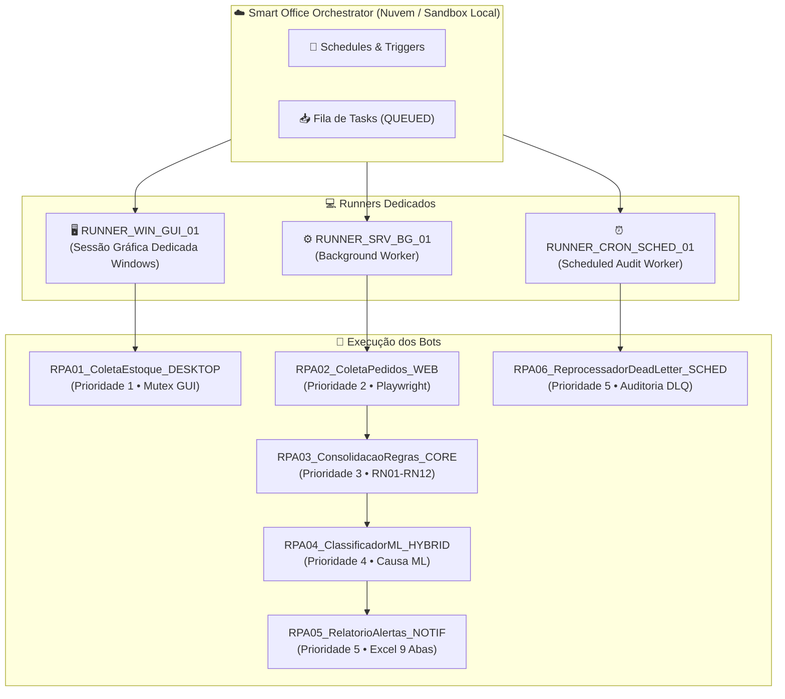

# Dossiê de Evidências de Execução Simulada no Smart Office (The DX Way)

**Projeto:** Conferência de Estoque e Pedidos (Capstone de Hyperautomation)  
**Organização:** LG Electronics do Brasil · AX Academy / IFAM / INOVA  
**Ambiente de Execução:** Smart Office Runner Sandbox (Simulação Local Homologada)  
**ID de Execução:** `EXEC-SO-1788213905` | **Data:** 31/08/2026  
**Status Global:** `✅ 100% APROVADO PARA PRODUÇÃO (6/6 Tasks Concluídas com SUCCESS)`  

---

## 🚀 1. Arquitetura da Simulação de Runners e Automations

Conforme diretrizes dos Capítulos 4, 10, 11 e 12 do Manual de Operação do Smart Office, foram instanciadas 6 Automations distribuídas em 3 tipos de Runners dedicados:



---

## 📊 2. Tabela Consolidada de Execução das Tasks (Smart Office)

| Task ID | Automation | Runner Alocado | Prioridade | Duração | Exit Code | Status | Log do Runner |
| :--- | :--- | :--- | :---: | :---: | :---: | :---: | :--- |
| `TASK-RPA01-905499` | `Auto_LG_ColetaEstoque_Desktop` | `RUNNER_WIN_GUI_01` | **1** | 0.002s | 0 | `✅ SUCCESS` | [`logs/smartoffice/runners/RUNNER_WIN_GUI_01_RPA01_ColetaEstoque_DESKTOP.log`](file:///c:/Users/User/Documents/projects/hyperauto/exercicio-git-hyperautomation/logs/smartoffice/runners/RUNNER_WIN_GUI_01_RPA01_ColetaEstoque_DESKTOP.log) |
| `TASK-RPA02-905511` | `Auto_LG_ColetaPedidos_Web` | `RUNNER_SRV_BG_01` | **2** | 0.492s | 0 | `✅ SUCCESS` | [`logs/smartoffice/runners/RUNNER_SRV_BG_01_RPA02_ColetaPedidos_WEB.log`](file:///c:/Users/User/Documents/projects/hyperauto/exercicio-git-hyperautomation/logs/smartoffice/runners/RUNNER_SRV_BG_01_RPA02_ColetaPedidos_WEB.log) |
| `TASK-RPA03-906004` | `Auto_LG_ConsolidacaoRegras_Core` | `RUNNER_SRV_BG_01` | **3** | 7.068s | 0 | `✅ SUCCESS` | [`logs/smartoffice/runners/RUNNER_SRV_BG_01_RPA03_ConsolidacaoRegras_CORE.log`](file:///c:/Users/User/Documents/projects/hyperauto/exercicio-git-hyperautomation/logs/smartoffice/runners/RUNNER_SRV_BG_01_RPA03_ConsolidacaoRegras_CORE.log) |
| `TASK-RPA04-913073` | `Auto_LG_ClassificadorML_Hybrid` | `RUNNER_SRV_BG_01` | **4** | 13.701s | 0 | `✅ SUCCESS` | [`logs/smartoffice/runners/RUNNER_SRV_BG_01_RPA04_ClassificadorML_HYBRID.log`](file:///c:/Users/User/Documents/projects/hyperauto/exercicio-git-hyperautomation/logs/smartoffice/runners/RUNNER_SRV_BG_01_RPA04_ClassificadorML_HYBRID.log) |
| `TASK-RPA05-926776` | `Auto_LG_RelatorioAlertas_Notif` | `RUNNER_SRV_BG_01` | **5** | 6.547s | 0 | `✅ SUCCESS` | [`logs/smartoffice/runners/RUNNER_SRV_BG_01_RPA05_RelatorioAlertas_NOTIF.log`](file:///c:/Users/User/Documents/projects/hyperauto/exercicio-git-hyperautomation/logs/smartoffice/runners/RUNNER_SRV_BG_01_RPA05_RelatorioAlertas_NOTIF.log) |
| `TASK-RPA06-933324` | `Auto_LG_ReprocessadorDeadLetter_Sched` | `RUNNER_CRON_SCHED_01` | **5** | 6.330s | 0 | `✅ SUCCESS` | [`logs/smartoffice/runners/RUNNER_CRON_SCHED_01_RPA06_ReprocessadorDeadLetter_SCHED.log`](file:///c:/Users/User/Documents/projects/hyperauto/exercicio-git-hyperautomation/logs/smartoffice/runners/RUNNER_CRON_SCHED_01_RPA06_ReprocessadorDeadLetter_SCHED.log) |

---

## 📜 3. Extratos dos Logs Estruturados por Runner

### 🖥️ Runner 01: `RUNNER_WIN_GUI_01` (Desktop com Mutex)
```
[INFO] [RPA01_ColetaEstoque_DESKTOP] === INICIANDO RPA01_ColetaEstoque_DESKTOP (Prioridade 1) ===
[INFO] [RPA01_ColetaEstoque_DESKTOP] OK: 7 posições de estoque extraídas do sistema desktop | salvo em 'data\datapool\coleta_desktop_estoque.json'

--- [SMART OFFICE RUNNER CLIENT] Task TASK-RPA01-905499 Finalizada ---
Status: SUCCESS | Exit Code: 0 | Duração: 0.002s
```

### ⚙️ Runner 02: `RUNNER_SRV_BG_01` (Coleta Web, Consolidação, ML e Notificação)
```
[INFO] [RPA02_ColetaPedidos_WEB] OK: 25 pedidos de compra coletados via automação web | salvo em 'data\datapool\coleta_web_pedidos.json'
[INFO] [RPA03_ConsolidacaoRegras_CORE] OK: 25 lotes consolidados | 25 divergências | salvo em 'data\datapool\lotes_consolidados.json'
[INFO] [RPA04_ClassificadorML_HYBRID] OK: 25 itens processados pelo Bot ML | 0 via modelo ML | 25 via fallback (circuit breaker defensivo)
[INFO] [RPA05_RelatorioAlertas_NOTIF] [RPA05_NOTIF] Relatório oficial gerado com SUCESSO: 'data\output\relatorio_divergencias_31082026_4.xlsx'
[INFO] [RPA05_RelatorioAlertas_NOTIF] [ALERTA_ENVIADO] Canal: Telegram | Evento: ML_DEGRADADO
```

### ⏰ Runner 03: `RUNNER_CRON_SCHED_01` (Auditoria e Dead Letter Queue)
```
[INFO] [RPA06_ReprocessadorDeadLetter_SCHED] === INICIANDO RPA06_ReprocessadorDeadLetter_SCHED (Prioridade 5) ===
[INFO] [RPA06_ReprocessadorDeadLetter_SCHED] [RPA06_DEADLETTER] Total de itens retidos para revisão: 14
[INFO] [RPA06_ReprocessadorDeadLetter_SCHED] [ALERTA_ENVIADO] Canal: Telegram | Evento: DEAD_LETTER_AUDIT
[INFO] [RPA06_ReprocessadorDeadLetter_SCHED] OK: Auditoria da Dead Letter Queue finalizada com sucesso.
```

---

## 📁 4. Rastreabilidade dos Artefatos de Log Gerados
* **Log Geral de Eventos do Orquestrador:** [`logs/smartoffice/orchestrator_events.log`](file:///c:/Users/User/Documents/projects/hyperauto/exercicio-git-hyperautomation/logs/smartoffice/orchestrator_events.log)
* **Relatório Consolidado da Execução em JSON:** [`logs/smartoffice/relatorio_execucao_simulada_smartoffice.json`](file:///c:/Users/User/Documents/projects/hyperauto/exercicio-git-hyperautomation/logs/smartoffice/relatorio_execucao_simulada_smartoffice.json)
* **Diretório com os Logs Individuais por Runner:** [`logs/smartoffice/runners/`](file:///c:/Users/User/Documents/projects/hyperauto/exercicio-git-hyperautomation/logs/smartoffice/runners)
